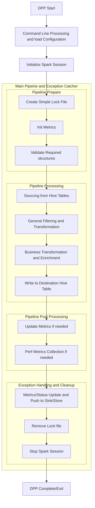

```mermaid
graph TD
  subgraph exceptHandle [Main Pipeine and Exception Catcher]
	subgraph prepare [Pipeline Prepare]
  lock[Create Simple Lock File]-->initMetrics[Init Metrics]-->validate[Validate Required structures]
  end
  subgraph process [Pipeline Processing]
	src[Sourcing from Hive Tables]-->filter1[General Filtering and Transformation]--> enrich1[Business Transformation and Enrichment]-->write[Write to Destination Hive Table]
	end
	subgraph post [Pipeline Post Processing]
	metricUpdate[Update Metrics if needed] --> perf[Perf Metrics Collection if needed]
	end
	subgraph exception [Exception Handling and Cleanup]
	metricPush[Metrics/Status Update and Push to Sink/Store] --> lockRemove[Remove Lock file] --> stop[Stop Spark Session]
	end
	end
	start[DPP Start]-->cli[Command Line Processing and load Configuration]-->init[Initialize Spark Session]--> lock
	validate --> src
	write --> metricUpdate
	perf --> metricPush
	stop --> complete[DPP Complete/End]
```

