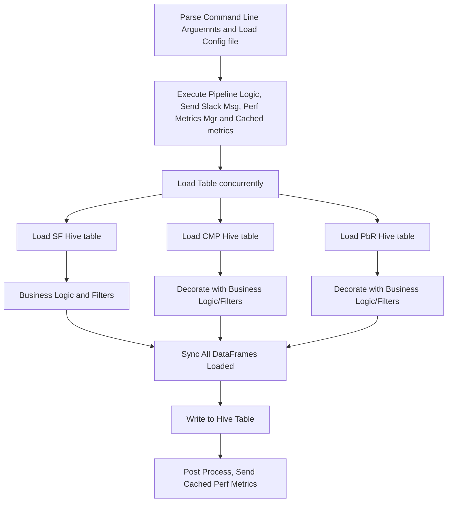

sbt

settingKey[[T] : Evaluated once per project load

taskKey[T]: evaluated every time it gets called

inputKey[T]: Accepts command-line arguments

Settings could depend on settings, but can't depend on tasks

Project / Config (Compile/Test/Runtime) / Task / Key

Task could depend on settings and/or tasks

- Sbt Shell
  - Help, inspect (inspect the kind of keys)
  - reload
  - ! Command
  - ;clean ;compile ;packageZipTarball



[Scala Best practices](https://nrinaudo.github.io/scala-best-practices/partial_functions/)

Pattern Matching

- assignment

  ``` Scala
  case class Animal(name: String, age: Int, classification: Classification)
  val animal = Animal("Jerry", 8, Classification("Mouse", "Mammal"))
  val Animal(name, _, species) = animal
  ```

- Embedded matching

  ```scala
  people match {
    case Seq(a, b, rest @ _*) => s"First two persons are $a and $b, the rest are $rest"
    case _ => s""
  }
  ```

- unapply/unapplySeq

  ```scala
  case class Animal(name: String, species: String)
  // This is used by pattern matching!
  object FarmAnimal {
    def unapply(animal: Animal): Option[String] = {
      if animal.species == "Cow" {
        Some(animal.name)
      } else {
        None
      }
    }
  }
  def namesOfFarmAnimals(animals: Seq[Animal]): Seq[String] = {
    animals.filter {
      case FarmAnimal(_) => true
      case _ => false
    }.map {
      case FarmAnimal(name) => name
      case _ => None
    }
  }
  def moveToFarm(myAnimals: Seq[Animal]): Seq[Animal] = {
    
  }
  object FarmTask {
    def unapply(animal: Animal): Option[(Animal, String)] = {
      if animal.species == "Cow" {
        Some(animal, "milking")
      } else {
        None
      }
    }
  }
  object FarmTasks {
    def unapplySeq(animal: Animal): Option[Seq[String]] = {
      if animal.species == "Cow" {
        Some(Seq("milking", "feeding", "task3"))
      } else {
        None
      }
    }
  }
  ```

  - [Type Erasure](https://gist.github.com/jkpl/5279ee05cca8cc1ec452fc26ace5b68b)
  
    - example
  
    - ```scala
      val lst2: List[(String, Int)] = List(("a", 1), ("b", 2))
      val lstString: List[String] = List("A", "B", "C")
      val lstInt: List[Int] = List(1,2,3,4)
      val lstWhatever: List[Double] = List(1.0,2.0,3.0)
      val tuple: (String, Int) = ("a", 100)
      val lstAny: List[Any] = List.empty
      
      lstAny match {
        case x:List[(String, Int)] =>
          println("This is a tuple list")
          x.foreach(println)
        // Anything below can't be reached
        case x: List[Int] =>
          println("This is a int list")
        case x: List[String] =>
          println("This is a string list")
        case _ =>
          println("This is reached as long as it is not a list")
      }
      
      ```
  
    - 

#### Partial Functions

- PartialFunction, isDefinedAt, orElse, applyOrElse

- ```Scala
  case class Animal(name: String, species: String)
  val santiago = Animal("Santiago", "Cat")
  val cleo = Animal("Cleo", "Dog")
  val meow: PartialFunction[Animal, String] = {
    case Animal(_, "Cat") => println("Cat"); "Meow"
    case Animal(_, "Tiger") => println("Tiger"); "Tiger"
  }
  meow(cleo)  // Error with match
  meow.isDefinedAt(cleo)  // false
  meow.isDefinedAt(santiago)  // true
  meow.isDefinedAt(Animal("A", "Tiger")) // true
  moew(Animal("A", "Tiger"))
  val woof: PartialFunction[Animal, String] = {
    case Animal(_, "Dog") => "Woof"
  }
  val speak = meow orElse woof
  speak(cleo)
  speak(Animal("A", "Cat"))
  ```

- 

#### Collection Features

- collect, collectFirst, partition, groupBy, lift (in addition to map, filter, flatMap)

  ```Scala
  // collect as combination of map and filter
  // collectFirst as collect with find
  // partition as collection chunking
  // groupBy for constructing Maps
  // lift for turning function-that-throws-exception into function-that-returns-an-Option
  val animals: Seq[Animal]
  animals.filter(_.age<10).map(_.name)
  animals.filter(_.age<10).filter(_.species == Cow).map(_.name)
  val x: Seq[String] = animals.collect {
    case Animal(name, age, _) if age < 10 => name
  }
  val xx:Seq[Animal] = animals.collect {
    case animal @ Animal(name, age, _) if age < 10 => animal
  }
  
  animal(100)  // exception out of bound
  animal.lift(100) // returns None, i.e. Option[Animal]
  ```

  

- Sorting collections

  - Sorted, sortWith, sortBy

- ```scala
  sealed trait Species
  case object Cow extends Species
  case object Horse extends Species
  case object Chicken extends Species
  case object Dog extends Species
  case object Cat extends Species
  case object Wolf extends Species
  
  case class Animal(name: String, age: Int, species: Species)
  val animals = Seq(
  	Animal("Babs", 12, Chicken),
  	Animal("Lady", 4, Chicken),
  	Animal("Babsie", 9, Cow),
  	Animal("Bessy", 12, Cow),
  	Animal("Lettie", 6, Cow),
  	Animal("Douglas", 12, Horse),
  	Animal("Cleo", 12, Dog),
  	Animal("Bonnie", 9, Dog),  
  	Animal("Santiago", 12, Cat),
  	Animal("Athena", 3, Cat)
  )
  
  Seq(4,56,67,62,7,5).sorted
  animals.sorted // error
  animals.sortWith(_.age < _.age)
  animals.sortBy(_.age)
  
  implicit val animalOrdering = Ordering.by[Animal, Int](_.age)
  ```

- 

#### For comprehensions

- ```scala
  for {
    animal <- animals
    if animal.age >= 10
  } yield {
    animal.name
  }
  
  for {
    animal <- animals
    _ = println(animal)
    age = animal.age
    if age >= 10
    _ = println(animal)
  } yield {
    animal.name
  }
  
  for {
    Animal(name, age, _) <- animals
    if age >= 10
  } yield {
    name
  }
  
  
  ```
  
- Trait Stacking and abstract override

  ```scala
  trait Animal {
    def liveOneDay: Seq[String]
  }
  trait FlyingAnimal extends Animal {
    abstract override def liveOneDay: Seq[String] = super.liveOneDay :+ "fly"
  }
  ```

  


#### Function Declaration Tricks

- All scala functions are instances of FUNCTIONX Types

- ```scala
  val doubler: Function1[Int, Int] = (x: Int) => 2 * x
  // equivalent of 
  /* 
  new Function1[Int, Int] {
  override def apply(x: Int) = 2 * x
  }
  */
  ```

- 

- Default Arguments, Pass-by-Name, pass-by-name for cleaner DSL

- ```scala
  def makeAnimal(name: String, age: Int = 0, species: Option[String] = None): String = {
    s"Animal $name is $age years old ${species.map { s => " and they are a " + s } getOrElse ""}."
  }
  makeAnimal("Alex", species = Some("Dog"))
  def makeAnimal2(name: String, age: Int = 0, species: Option[String]): String = {
    s"Animal $name is $age years old ${species.map { s => " and they are a " + s } getOrElse ""}."
  }
  makeAnimal2("Alex", species = Some("Dog"))
  makeAnimal2("Alex", 0, Some("Dog"))
  
  def youngName(name: String): String = {
    println("creating young name:")
    "young" + name
  }
  def oldName(name: String): String = {
    println("creating old name:")
    "old" + name
  }
  
  def youngOrOld(age: Int, youngName: String, oldName: String) = {
    if (age < 10) {
      youngName
    } else {
      oldName
    }
  }
  youngOrOld(12, youngName("Alex"), oldName("Bob"))  
  
  def youngOrOld2(age: Int, youngName: ()=>String, oldName: ()=>String): String = {
    if (age < 10) {
      youngName
    } else {
      oldName
    }
  }
  youngOrOld(12, youngName("Alex"), oldName("Bob"))  // Error
  
  // Call by Name
  def youngOrOld3(age: Int, youngName: =>String, oldName: =>String): String = {
    if (age < 10) {
      youngName
    } else {
      oldName
    }
  }
  youngOrOld3(12, youngName("Alex"), oldName("Bob")) 
  
  // Patterns to wraps things around, e.g. exception handling, logging
  def printArithmeticErrors[T](fn: =>T): Option[T] = {
    try {
      Some(fn)
    } catch {
      case arithmeticException: ArithmeticException =>
      	println(arithmeticException)
  	    None
    }
  }
  printArithmeticErrors(5/0)
  printArithmeticErrors {
    (0 to 5).map(5/_)
  }
  ```

- Exception, [examples](https://pedrorijo.com/blog/scala-exceptions/)

- ```scala
  import scala.util.control.Exception
  import java.text.{SimpleDateFormat, ParseException}
  import java.util.Date
  
  // The following two are equivalent
  handling(t) by g apply f 
  try { f } catch { case _ : t => g }
  
  // e.g.
  def parse(s: String) : Date = new SimpleDateFormat("yyyy-MM-dd").parse(s)
  def parseDate = parse(System.getProperty("foo.bar"))
  
  val date = handling(classOf[PE], classOf[java.lang.NullPointerException]) by (_ => new Date) apply parseDate
  ```

- Partial application, currying

  ```scala
  object DataAccess {
    def saveCustomer(databaseConnection: DatabaseConnection)(c: Customer) = ???
  }
  val saveCustomer: Customer => Customer = DataAccess.saveCustomer(dbConnection)
  
  // similarly
  class DataAccessClass(databaseConnection: DatabaseConnection) {
    def saveCustomer(c: Customer): Customer = ???
  }
  ```

  

#### Advanced

- trailrec

- ```scala
  {
    sealed trait TreeEntry
    case class Branch(children: Seq[TreeEntry]) extends TreeEntry
    case class Leaf(content: String) extends TreeEntry
  }
  
  val t = Branch(Seq(Leaf("hello"), Branch(Seq(Leaf("hi"), Leaf("bye")))))
  
  def uniqueContent(root: TreeEntry): Set[String] = {
    root match {
  		case Branch(children) => children.foldLeft(Set[String]())(_ ++ uniqueContent(_))
      case Leaf(content) =>
  	    Set(content)
    }
  }
  uniqueContent(t)
  var deepNest = Branch(Seq.empty)
  // create a deep nested tree
  for (i <- 1 to 4000) { deepNest = Branch(Seq(deepNest)) }
  
  uniqueContent(deepNest) // stack overflow error
  
  @annotation.tailrec def trUniqueContent2(currentLevel: Seq[TreeEntry], seenSoFar: Set[String] = Set.empty): Set[String] = {
    currentLevel match {
  		case Seq(Branch(children), rest @ _*) => 
      	trUniqueContent2(children ++ rest, seenSoFar)
      case Seq(Leaf(content), rest @ _*) =>
  	    trUniqueContent2(rest, seenSoFar + content)
      case _ => seenSoFar
    }
  }
  trUniqueContent2(Seq(t))
  trUniqueContent2(Seq(deepNest))
  
  
  ```

- Jump Table and annotation.switch

- ```scala
  (5: @annotation.switch) match {
    case 5 => "Hello"
    case 3 => "bye"
    case _ => "done"
  }
  
  // ammnite
  // interp.configureCompiler(_settings.nomarnings.value = false) 
  case class Test(in: String)
  (Test("hai") : @annotation.switch) match {
    case Test("hai") => "hai"
    case Test("bai") => "bai"
    case _ => "done"
  }
  ```

- Value classes: one attribute and extends AnyVal

- ```scala
  case class MyValue(val int: Int) extends AnyVal
  class MyValue2(val int: Int) extends AnyVal {
    def withExtra5 = int + 5
  }
  trait MyUniversalTrait extends Any {
    def int: Int
    def withExtra5 = int + 5
  }
  
  class MyValue3(val int:Int) extends AnyVal with MyUniversalTrait
  ```

- Implicit Parameters

- ```scala
  // check implicit in scope
  implicitly[String]
  implicitly[Option[Int]]
  ```

- Typeclass [Explained](https://scalac.io/typeclasses-in-scala/)

    - Earlier we insinuated that all type class instances are implicit vals. This was a simplifica􏰀on. We can actually define instances in two ways:

        1. by defining concrete instances as implicit vals of the required type4;
        2. bydefiningimplicitmethodstoconstructinstancesfromothertype class instances.

        Why would we construct instances from other instances? As a mo􏰀va􏰀onal example, consider defining a JsonWriter for Options. 

- ```scala
  trait Printable[T] {
    def print(item: T): Unit
  }
  val intPrintable = new Printable[Int] { def print(item: Int) = { println(item) }} // TypeClass i.e. Int Class
  
  trait Adder[T] {
    def add(a: T, b: T): T
  }
  
  object Adder {
    // "Summoner" method
    def apply[A](implicit ev: Adder[A]): Adder[A] = ev
  
    // "Constructor" method
    //def instance[A](func: A => List[String]): CsvEncoder[A] = new CsvEncoder[A] {
    //    def encode(value: A): List[String] =
    //      func(value)
    //}
    def instance[A](func: (A, A) => A): String = new Adder[A] {
        def add(valueA: A, ValueB: A): A = func(valueA, valueB)
    }
  
    // Globally visible type class instances
    implicit val intAdder = instance[Int]( (a,b) -> a + b)
  }
  
  def addTwoThings[T](a: T, b: T)(implicit adder: Adder[T]) = {
    adder.add(a, b)
  } // Need to define a Adder T Class (TypeClass) to use this function
  
  
  def addTwoThings[T](a: T, b: T)(implicit adder: Adder[T], printable: Printable[T]) = {
    printable.print(a)
    printable.print(b)
    adder.add(a, b)
  }
  
  trait Show[A] {
    def show(a: A): String
  }
  
  object Show {
    // "Summoner" method
  	// def apply[A](implicit enc: CsvEncoder[A]): CsvEncoder[A] = enc
    def apply[A](implicit sh: Show[A]): Show[A] = sh
  
    // "Constructor" method
    //def instance[A](func: A => List[String]): CsvEncoder[A] = new CsvEncoder[A] {
    //    def encode(value: A): List[String] =
    //      func(value)
    //}
    def instance[A](func: A => String): String = new Show[A] {
        def show(value: A): String = func(value)
    }
  
    // Globally visible type class instances
    
    //needed only if we want to support notation: show(...)
    def show[A: Show](a: A) = Show[A].show(a)
  
    implicit class ShowOps[A: Show](a: A) {
      def show = Show[A].show(a)
    }
  
    //type class instances
    implicit val intCanShow: Show[Int] =
      int => s"int $int"
  
    implicit val stringCanShow: Show[String] =
      str => s"string $str"
  }
  ```

- Implicit Class and object extensions (implict class and value class)

- ```scala
  implicit class MagicInterpolater(val sc: StringContext) {
    def m(parameters: Any*) = {
      println(sc.parts)
      println(parameters)
    }
  }
  
  val name = "Alex"
  m"Hello $name"
  m"Hello $name $name world"
  
  implicit class MagicInterpolater(val sc: StringContext) {
    def m(parameters: Any*) = {
      sc.parts.zipAll(parameters, "", "") match {
        case ("", param) => param
        case (part, "") => part
        case (part, param) => s"$part:MAGIC:$param"
      }.mkString("\n")
    }
  }
  
  implicit class PoundifyStrings(val string: String) extends AnyVal {
    def poundify: String = {
      string.replace(" ", "#")
    }
  }
  "test test test".poundify
  ```

- Interop with Java, Profiling

- ```scala
  import scala.collection.JavaConverters._
  ```

- [Types](https://kubuszok.com/2018/kinds-of-types-in-scala-part-1/)

  - Scala has also the notion of the top and bottom types. The top type - a type we don’t have any assertions about, which contains any other type - is `Any`. In Java, the closest thing would be an `Object`, except it is not a supertype for primitives. Scala’s `Any` is a supertype for both objects (`AnyRef`) and primitives (`AnyVal`). When we see `Any` as an inferred type, it usually means we messed up and combined two unrelated types.

    The bottom type - a type which is a subtype of all others, and has no citizen - in Scala is `Nothing`. We cannot construct a value of type `Nothing`, so it often appears as a parameter of empty containers or functions that can only throw.

    (Quite often I see that `Null` is mentioned as another bottom type in Scala together with `Nothing`. It is a type extending everything that is an `Object` on JVM. So it is kind of like `Nothing` without primitives, `Unit`/`void`, and functions that only throws).

    Also, a word about functions. In Scala we make a distinction between a function and a method. A **function type** is a value, which can be called:

    A **method**, on the other hand, **is not a value**. It cannot be assigned, or directly passed, though via a process called **eta-expansion** a method can be turned into a function.

    ```scala
    val times2: Int => Int = x => x * 2
    def times2(x: Int): Int = x * 2
    // val y = def times2(x: Int): Int = x * 2 - error!
    val y = { def times2(x: Int): Int = x * 2 } // Unit
    // however
    val z: Int => Int = times2 _ // works!
    ```

    Less accurate, but simpler version: a function is an instance of some `Function0`, `Function1`, …, `Function22` trait, while a method is something bound to a JVM object. We make a distinction because authors of Scala haven’t solved the issue in a more elegant way.

  - Algebraic Data Types
    When we think of types as a sets, there are 2 special constructions, that help us build new sets from existing ones, which complement each other. One is a [Cartesian product](https://en.wikipedia.org/wiki/Cartesian_product) and the other is a [disjoint union/disjoint set sum (coproduct)](https://en.wikipedia.org/wiki/Disjoint-set_data_structure).
    Product types and sum types together are known as **algebraic data types**.

    Scala 2.x doesn’t allow to actually build up an union from already existing types. If we want to let compiler know that types should form a coproduct, we need to use a **sealed hierarchy**:

    ```scala
    sealed trait Either[+A, +B] {}
    case class Left[+A, +B](a: A) extends Either[A, B]
    case class Right[+A, +B](b: B) extends Either[A, B]
    
    sealed trait Option[+A] {}
    case class Some[A](value: A) extends Option[A]
    case object None extends Option[Nothing]
    ```

  - We can calculate a sum of sets (sum type), a Cartesian product of sets (product type), why not an intersection? We can declare a type belonging to several types using… `with` keywords (yup, it’s more than just a mixin!).
    **the order of composing type using `with` does not matter**

  - ```scala
    trait Str { def str: String }
    trait Count { def count: Int }
    
    def repeat(cd: Str with Count): String =
      Iterator.fill(cd.count)(cd.str).mkString
    
    repeat(new Str with Count {
      val str = "test"
      val count = 3
    })
    // "testtesttest"
    ```

  - Diamond problem, Solution: Trait Linearization

    Remember that the syntax to mixin traits is as follows: `class A extends B with C with D`. The rules for this process are as follows:
  
    1. Start at the first extended class or trait and write that complete hierarchy down. We will call this the **linearized hierarchy**
    2. Take the next trait and write this hierarchy down
       - now remove all classes/traits from this hierarchy which are already in the **linearized hierarchy**
       - add the remaining traits to the bottom of the **linearized hierarchy** to create the new **linearized hierarchy**
    3. repeat step 2 for every trait.
    4. Place the class itself as the last type extending the **linearized hierarchy**
  
  - ```scala
    trait A { def value = 10 }
    trait B extends A { override def value = super.value * 2 }
    trait C extends A { override def value = super.value + 2 }
    (new B with C {}).value // ???
    (new C with B {}).value // ???
    // trait linearization
    
    trait X extends A with B with C
    
    trait AnonymousB extends A {
      // B overrides A
      override def value = super.value * 2
    }
    trait AnonymousC extends AnonymousB {
      // C overrides AnonymousB
    override def value = super.value + 2
    }
    trait X extends AnonymousC
    
    ```
  
  (new B with C {}).value // (10 * 2) + 2 = 22 
    (new C with B {}).value // (20 + 2) * 2 = 24
  
    ```
  
    ```
  
- ## Kinds and higher-kinded-types

  These *types of types* (a type, a type constructor, etc) are known as [**kinds**](https://en.wikipedia.org/wiki/Kind_(type_theory)). Scala let us investigate them in REPL using `:kind`

  - Type Constraints

    - `<:` denotes an upper bound in type parameters. 
    - There is also a notation for lower bound, `>:`
  - `<:<` - let us require that one type is a *subclass* the other. It is defined inside a `scala.Predef`.

  ```scala
    def upcast[A, B](set: Set[A])(
      implicit ev: A <:< B
    ): Set[B] = set.map(ev(_))
      
    upcast[Member, User](Set(m: Member)) // Set[User]
  ```

    - `=:=` - let us require that one is *equal* to the other.

      ```scala
      def update[A, B](set: Set[A])(f: A => B)(
        implicit ev: A =:= B
      ): Set[B] = set.map(f)
        
      ```

    val members: Set[Member]
        
    update[Member, Member](members)(identity) // ok
      update[Member, User](members) { member =>
      member: User
      } // compilation error!
      ```

    

  - `=:!=` - provided by shapeless. Proves, that types are *different*.

  - Variance

    - Invariance means, that even if `B <: A` then `Option[B]` still cannot be substituted for `Option[A]`. It is a default and a good one!

    - if `B >: A` then `F[B] >: F[A]` is called **covariance**. To mark a type parameter as covariant we use `+`

    - Case where we want to say that `A <: B` implies `F[B] >: F[A]` is called **contravariance** as it is an opposition of covariance. We denote it with `-` sign

    - Function **arguments** are **contra-variance** and result is **covariance**. **This means that** (Scala compiler checks them) see [video](https://www.youtube.com/watch?v=QDzPNv4UIkY)

      - **covariant** *type parameters* can only appear in method **results**

      - **contravariant** *type parameters* can only appear in method **parameters**

      - **invariant** *type parameters* can appear anywhere

      - **covariant** *type parameters* **may** appear in lower bounds of method type parameters

      - **contravariant** *type parameters* **may** appear in upper bounds of method type parameters

        ```Scala
        // Example of valid def`
        trait Function1[-T, +U] {
          def apply(x: T): U
        }
        // How to make covariance in argument?
        trait List[+T] {
          def prepend[U >: T](elem: U): List[U]
        }
        ```

        

  - F-bound Types

  - Structural and refined Types
    We can call `User` a **structural type**. It is an interesting way of implementing a type, one where compiler checks if object has all the right methods and fields instead of scanning the class hierarchy. A problem with such approach is that in runtime Scala has to use a runtime reflection to access these fields, so it comes with a performance penalty.

    ```scala
    type User = {
      val name: String
      val surname: String
    }
    case class Somebody(name: String, surname: String)
    
    def needUser(user: User): Unit
    
    needUser(Somebody("test", "test")) // works!
    
    trait X { val x: String }
    type Y = { val y: Int }
    val z: X with Y = new X { val x = "test"; val y = 0 }
    ```

  - Path-dependent Types
    **Path-dependent types** are way of stating that type of one object, depends on another object. It is a limited version of more generic idea of [dependent types](https://en.wikipedia.org/wiki/Dependent_type).
    To create a path-dependent type, all we need is to declare a type inside another type! It doesn’t have to be a class

    ```scala
    class Game {
      
      case class Card(color: String, value: String)
      case class Player(name: String)
      
      def getPlayers: Set[this.Player] = ???
      
      def getCards: Set[this.Card] = ???
      
      def playerPlayCard(player: this.Player, card: this.Card): Unit = ???
    }
    
    val game1 = new Game
    val game2 = new Game
    game1.getPlayers // Set[game1.Player]
    game2.getPlayers // Set[game2.Player]
    
    game1.playerPlayCard(game2.getPlayers.head,
                         game2.getCards.head) // fails!
    
    class X {
      type Y = String
      val y: Y = "y"
    }
    
    val x1 = new X
    val x2 = new X
    // However, if it’s just a type alias, Scala can prove that 2 types are the same, and so it will not help us much:
    
    def y(x: X)(y: x.Y): Unit = ()
    
    y(x1)(x2.y) // no complaints: x1.Y = String = x2.Y
    
    // unless we make it a little less obvious, that the types are equal:
    trait X {
      type Y = String
      val y: Y = "y"
    }
    
    ```

  class X2 extends X

  val x1 = new X2
  val x2 = new X2

    y(x1)(x2.y) // fails!
    ```
  
    ```scala
  //OK, but what if we wanted to lose our requirements at some point?
    
    def takeAnyPlayer(p: ???): Unit
    //We need to indicate a way of passing path-dependent type without its the context if needed. Such ability is granted to us via #:
    
    def takeAnyPlayer(p: Game#Player): Unit
  
    // At this point there is very little we know for certain about our p. Scala most won’t be able to tell what is the exact type even if it would be obvious to you from the code. If there were some type constraints about the type, that would be guaranteed, you can rely on it. But anything that comes with the specification of path-dependent type is lost:
    
  
    trait X {
      type Y <: AnyVal { def toLong: Long }
      val y: Y
    }
    
    val x1 = new X {
      override type Y = Int
      override val y: Y = 1
    }
    val x2 = new X {
      override type Y = Long
      override val y: Y = 1L
    }
    
    x1.y * x1.y // 1: Int
    x2.y * x2.y // 1: Long
    ```

  - Kind projector/type lambda

    ```
    scala> :kind ({ type T[A] = Either[String, A] })#T
    scala.util.Either[String,?]'s kind is F[+A]
    ```

    We start with `Either[_, _]` and we want to partially apply `String` as the first type parameter. In order to do so, we:

  - create a type alias `T[A] = Either[String, A]`, which creates a parametric type `T[A]` with one type parameter,
    
    - we put it inside a structural type to create an opportunity for creating a path-dependent type,
    
  - finally we extract `T` as a path-dependent type, such that Scala can tell its specific type exactly,
    - since we didn’t applied type parameters, we end up with a single parameter type constructor,
    - we achieved partial-application of a type parameters to a type constructor, aka **type lambda** or **kind projection**.

  - Self Types
    Mixins. Sometimes we want to add some functionality to existing class and traits are a great way of achieving that:

    ```scala
    class Producer {
      def produce: Int = 1
    }
    
    trait DoubleProducer extends Producer {
      override def produce: Int = super.produce * 2
    }
    
    trait IncreaseProducer extends Producer {
      override def produce: Int = super.produce + 1
    }
    
    class MyProducer extends Producer with DoubleProducer with IncreaseProducer
    
    (new MyProducer).produce // 3
    
    // Mixin
    trait Producer {
      def produce: Int
    }
    
    // Don't need to extends Producer
    trait DoubleProducer { self: Producer =>
      override def produce: Int = super.produce * 2
    }
    ```

    Self-types, might be used to enforce ordering of [low-priority implicits](https://kubuszok.com/2018/implicits-type-classes-and-extension-methods-part-4/#troublesome-cases):

  - **Functional Programming in Scala**

    - Exception Handling

      - Option, [Either and Try](https://mauricio.github.io/2014/02/17/scala-either-try-and-the-m-word.html)

        - A common pattern is to transform an Option via calls to ***map, flatMap***, and/or ***filter***, and then use ***getOrElse*** to do error handling at the end. Use ***filter*** to convert successes into failures if the successful values don’t match the given predicate.

          ```scala
          case class Employee(name: String, department: String)
          def lookupByName(name: String): Option[Employee] = ...
          val joeDepartment: Option[String] =lookupByName("Joe").map(_.department)
          
          val dept: String = lookupByName("Joe").map(_.dept).filter(_ != "Accounting").getOrElse("Default Dept")
          ```

        - A common idiom is to do ***o.getOrElse***(throw new Exception("FAIL")) to convert the None case of an Option back to an exception. ***orElse*** is similar to getOrElse, except that we return another Option if the first is undefined. This is often useful when we need to chain together possibly failing computations, trying the second if the first hasn’t succeeded

      - #### Option composition, lifting, and wrapping exception-oriented APIs

        - [Option cheat sheet](https://blog.tmorris.net/posts/scalaoption-cheat-sheet/)
    - ***map*** turns a function f of type A => B into a function of type Option[A] => Option[B]
      
        ```Scala
        def lift[A,B](f: A => B): Option[A] => Option[B] = _ map f	
        // examples:
        val absO: Option[Double] => Option[Double] = lift(math.abs)
        
        // two parameters
        def map2[A,B,C](a: Option[A], b: Option[B])(f: (A, B) => C): Option[C] = 
        a flatMap (aa => b map (bb => f(aa, bb)))
        
        def map2[A,B,C](a: Option[A], b: Option[B])(f: (A, B) => C): Option[C] = 
         for {
            aa <- a
            bb <- b
          } yield f(aa, bb)
        
      ```
  
  - Infinite streams (lazy lists)
  
      - ```Scala
        val ones: Stream[Int] = Stream.cons(1, ones)
        ones.take(5).toList
        ones.exists(_ % 2 != 0)
      ```
  
  - [Functor/Applicative/Monad explained](http://blog.forec.cn/2017/03/02/translation-adit-faamip/) [English version](http://adit.io/posts/2013-04-17-functors,_applicatives,_and_monads_in_pictures.html)
  
    - [Another explain](https://www.dazhuanlan.com/2019/11/12/5dc9b204efc94/)
  
    - Monoid
  
        ```scala
        trait Monoid[A] {
          def op(a1: A, a2: A): A
          def zero: A
        }
      ```
  
      
  
    - Functor
  
        ```Scala
        trait Functor[F[_]] {
          def map[A,B](fa: F[A])(f: A => B): F[B]
        }
        val listFunctor = new Functor[List] {
          def map[A,B](as: List[A])(f: A => B): List[B] = as map f
        }
      ```
  
    - ### MONADS: GENERALIZING THE FLATMAP AND UNIT FUNCTIONS [explained](https://medium.com/free-code-camp/demystifying-the-monad-in-scala-cc716bb6f534)
  
        ```scala
        trait Monad[F[_]] extends Functor[F] {
          def unit[A](a: A): F[A]  // This could be the apply() in companion object
          def flatMap[A, B](ma: F[A])(f: A => F[B]): F[B]
          
          def map[A, B](ma: F[A])(f: A => B): F[B] = 
          	flagMap(ma)(a => unit(f(a)))
          def map2[A, B, C](ma: F[A], mb: F[B])(f: (A,B) => C): F[C] = 
          	flagMap(ma)(a => map(mb)(b => f(a, b)))
        }
        
        // monad laws
        // if we have some basic value x, a monad instance m (holding some value) and 
        // functions f and g of type Int → M[Int], we can write the laws as follows
        // 1. left-identity law: 
        unit(x).flatMap(f) == f(x)
        // 2. right-identity law: 
        m.flatMap(unit) == m
        // 3. associativity law:
        m.flatMap(f).flatMap(g) == m.flatMap(x ⇒ f(x).flatMap(g))
        
      ```
  
    - Monad
  
      - We’ve seen three minimal sets of primitive Monad combinators, and instances of Monad will have to provide implementations of one of these sets:
  
        unit and flatMap
        unit and compose
        unit, map, and join
  
      - A monad is an implementation of one of the minimal sets of monadic combinators, satisfying the laws of associativity and identity.
  
      - We can see that a chain of flatMap calls (or an equivalent for-comprehension) is like an imperative program with statements that assign to variables, and the monad specifies what occurs at statement boundaries. For example, with Id, nothing at all occurs except unwrapping and rewrapping in the Id constructor. With State, the most current state gets passed from one statement to the next. With the Option monad, a statement may return None and terminate the program. With the List monad, a statement may return many results, which causes statements that follow it to potentially run multiple times, once for each result. The Monad contract doesn’t specify what is happening between the lines, only that whatever is happening satisfies the laws of associativity and identity.
  
  - Pure Functional State
  
    - Making stateful APIs pure
  
      - having the API *compute* the next state rather than actually mutate anything, e.g.
  
          ```Scala
          class Foo {
            private var s: FooState = ...
            def bar: Bar
            def baz: Int
          }
          // ==>
          trait Foo {
            def bar: (Bar, Foo)
            def baz: (Int, Foo)
          }
        ```
  
      - Functions of this type are called ***state actions*** or ***state transitions*** because they transform RNG states from one to the next. These state actions can be combined using *combinators*, which are higher-order functions that we’ll define below
  
        
  
          ```Scala
          
          // State actions or state transition
          type Rand[+A] = RNG => (A, RNG)
          
          // 
          def unit[A](a: A): Rand[A] =
            rng => (a, rng)
          //There’s also map for transforming the output of a state action without modifying the state itself. Remember, Rand[A] is just a type alias for a function type RNG => (A, RNG), so this is just a kind of function composition:
          def map[A,B](s: Rand[A])(f: A => B): Rand[B] =
            rng => {
              val (a, rng2) = s(rng)
              (f(a), rng2)
            }
          // A general state actions map
          def map[S,A,B](a: S => (A,S))(f: A => B): S => (B,S)
          // general form of Rand[+A]
          type State[S,+A] = S => (A,S)
          type Rand = State[RNG, A]
          // we could write its own class
          case class State[S,+A](run: S => (A,S))
          case class State[S, +A](run: S => (A, S)) {
            def map[B](f: A => B): State[S, B] =
              flatMap(a => unit(f(a)))
            def map2[B,C](sb: State[S, B])(f: (A, B) => C): State[S, C] =
              flatMap(a => sb.map(b => f(a, b)))
            def flatMap[B](f: A => State[S, B]): State[S, B] = State(s => {
              val (a, s1) = run(s)
              f(a).run(s1)
            })
          }
          
          object State {
            type Rand[A] = State[RNG, A]
          
            def unit[S, A](a: A): State[S, A] =
              State(s => (a, s))
          
            // The idiomatic solution is expressed via foldRight
            def sequenceViaFoldRight[S,A](sas: List[State[S, A]]): State[S, List[A]] =
              sas.foldRight(unit[S, List[A]](List()))((f, acc) => f.map2(acc)(_ :: _))
          
            // This implementation uses a loop internally and is the same recursion
            // pattern as a left fold. It is quite common with left folds to build
            // up a list in reverse order, then reverse it at the end.
            // (We could also use a collection.mutable.ListBuffer internally.)
            def sequence[S, A](sas: List[State[S, A]]): State[S, List[A]] = {
              def go(s: S, actions: List[State[S,A]], acc: List[A]): (List[A],S) =
                actions match {
                  case Nil => (acc.reverse,s)
                  case h :: t => h.run(s) match { case (a,s2) => go(s2, t, a :: acc) }
                }
              State((s: S) => go(s,sas,List()))
            }
          
            // We can also write the loop using a left fold. This is tail recursive like the
            // previous solution, but it reverses the list _before_ folding it instead of after.
            // You might think that this is slower than the `foldRight` solution since it
            // walks over the list twice, but it's actually faster! The `foldRight` solution
            // technically has to also walk the list twice, since it has to unravel the call
            // stack, not being tail recursive. And the call stack will be as tall as the list
            // is long.
            def sequenceViaFoldLeft[S,A](l: List[State[S, A]]): State[S, List[A]] =
              l.reverse.foldLeft(unit[S, List[A]](List()))((acc, f) => f.map2(acc)( _ :: _ ))
          
            def modify[S](f: S => S): State[S, Unit] = for {
              s <- get // Gets the current state and assigns it to `s`.
              _ <- set(f(s)) // Sets the new state to `f` applied to `s`.
            } yield ()
          
            def get[S]: State[S, S] = State(s => (s, s))
          
            def set[S](s: S): State[S, Unit] = State(_ => ((), s))
          }
          
        ```
  
- Factoring Effects
  
  - Given an impure function f of type A => B, we can split f into two functions:
  
    - A *pure* function of type A => D, where D is some *description* of the result of f.
  
    - An *impure* function of type D => B, which can be thought of as an *interpreter* of these descriptions.
  
    - Example: 
  
        ```Scala
        case class Player(name: String, score: Int)
        
        def contest(p1: Player, p2: Player): Unit =
          if (p1.score > p2.score)
          println(s"${p1.name} is the winner!")
        else if (p2.score > p1.score)
          println(s"${p2.name} is the winner!")
        else
          println("It's a draw.")
        
        def winner(p1: Player, p2: Player): Option[Player] = {
          if (p1.score > p2.score) Some(p1)
          else if (p1.score < p2.score) Some(p2)
          else None
        }
        def winnerMsg(p: Option[Player]): String = p map {
          case Player(name, _) => s"$name is the winner!"
        } getOrElse "It's a draw."
        
        def contest(p1: Player, p2: Player): Unit = println(winnerMsg(winner(p1, p2)))
        
        //------------------
        trait IO {  def run: Unit }
        
        def PrintLine(msg: String): IO =
          new IO {  def run = println(msg) }
        
        def contest(p1: Player, p2: Player): IO =
          PrintLine(winnerMsg(winner(p1, p2)))
      ```
  
        

#### Shapeless

- [Shapeless and Spark](https://medium.com/build-and-learn/is-shapeless-worth-it-what-is-shapeless-anyway-900cba6b717a)

- [Get started with Shapeless](https://jto.github.io/articles/getting-started-with-shapeless/)

- [a blog](https://lepovirta.org/posts/2015-10-30-solving-problems-in-a-generic-way-using-shapeless.html)

- [Herding Cats](http://eed3si9n.com/herding-cats/)

- [Spark StructType encoder using shapeless](https://benfradet.github.io/blog/2017/06/14/Deriving-Spark-Dataframe-schemas-with-Shapeless)

- Idiomatic Type Class definition

  ```scala
  trait CsvEncoder[A] {
     def encode(value: A): List[String]
  }
  
  object CsvEncoder {
  // "Summoner" method
  def apply[A](implicit enc: CsvEncoder[A]): CsvEncoder[A] =
  enc
    // "Constructor" method
  def instance[A](func: A => List[String]): CsvEncoder[A] = new CsvEncoder[A] {
        def encode(value: A): List[String] =
          func(value)
  }
    // Globally visible type class instances
  }
  ```

  

- Instances

- ```Scala
  def createEncoder[A](func: A => List[String]): CsvEncoder[A] = new CsvEncoder[A] {
      def encode(value: A): List[String] = func(value)
    }
  implicit val stringEncoder: CsvEncoder[String] =
    createEncoder(str => List(str))
  implicit val intEncoder: CsvEncoder[Int] =
    createEncoder(num => List(num.toString))
  implicit val booleanEncoder: CsvEncoder[Boolean] = createEncoder(bool => List(if(bool) "yes" else "no"))
  
  ```

- ***Aux type aliases*** 

  ```scala
  implicit def genericEncoder[A, R](
    implicit
    gen: Generic[A] { type Repr = R },
    enc: CsvEncoder[R]
  ): CsvEncoder[A] =
    createEncoder(a => enc.encode(gen.to(a)))
  ```

  Type refinements like Generic[A] { type Repr = L } are verbose and difficult to read, so shapeless provides a type alias Generic.Aux to rephrase the type member as a type parameter: 

  ```scala
  package shapeless
  object Generic {
    type Aux[A, R] = Generic[A] { type Repr = R }
  ```

  } 

  Using this alias we get a much more readable defini􏰀on: 

  ```scala
  implicit def genericEncoder[A, R](
    implicit
    gen: Generic.Aux[A, R],
    env: CsvEncoder[R]
  ): CsvEncoder[A] =
    createEncoder(a => env.encode(gen.to(a)))
  ```

  Note that the Aux type isn’t changing any seman􏰀cs—it’s just making things easier to read. This “Aux pattered􏰁ern” is used frequently in the shape- less codebase. 

- Taking all of this into account, we can write a common skeleton for deriving type class instances as follows. 

  First, define the type class: 

  ```scala
   trait MyTC[A]
  ```

  Define primi􏰀ve instances: 

  ```scala
  implicit def intInstance: MyTC[Int] = ???
  implicit def stringInstance: MyTC[String] = ???
  implicit def booleanInstance: MyTC[Boolean] = ???
  ```

  Define instances for HList: 

  ```scala
  import shapeless._
  implicit def hnilInstance: MyTC[HNil] = ???
  implicit def hlistInstance[H, T <: HList](
    implicit
    hInstance: Lazy[MyTC[H]], // wrap in Lazy
    tInstance: MyTC[T]
  ): MyTC[H :: T] = ???
  ```

  If required, define instances for Coproduct: 

  ```scala
  implicit def cnilInstance: MyTC[CNil] = ???
  implicit def coproductInstance[H, T <: Coproduct](
    implicit
    hInstance: Lazy[MyTC[H]], // wrap in Lazy
    tInstance: MyTC[T]
  ): MyTC[H :+: T] = ???
  ```

  Finally, define an instance for Generic: 

  ```scala
  implicit def genericInstance[A, R](
    implicit
    generic: Generic.Aux[A, R],
    rInstance: Lazy[MyTC[R]] // wrap in Lazy
  ): MyTC[A] = ???
  ```

  In the next chapter we’ll cover some useful theory and programming pa􏰁erns to help write code in this style. In Chapter 5 we will revisit type class deriva􏰀on using a variant of Generic that allows us to inspect field and type names in our ADTs. 

- The intui􏰀ve take-away from this is that type parameters are useful as “inputs” and type members are useful as “outputs”. 

- ***Summoner methods versus “implicitly” versus “the”*** 

  Note that the return type on apply is Aux[L, O], not Second[L]. This is important. Using Aux ensures the apply method does not erase the type members on summoned instances. If we define the return type as Second[L], the Out type member will be erased from the return type and the type class will not work correctly. 

  The **implicitly** method from scala.Predef has this behaviour. Compare the type of an instance of Last summoned with implicitly:  

  ```scala
  implicitly[Last[String :: Int :: HNil]]
  // res6: shapeless.ops.hlist.Last[String :: Int :: shapeless. HNil] = shapeless.ops.hlist$Last$$anon$34@651110a2 
  ```

  to the type of an instance summoned with Last.apply: 

  ```scala
  Last[String :: Int :: HNil]
  // res7: shapeless.ops.hlist.Last[String :: Int :: shapeless. HNil]{type Out = Int} = shapeless.ops. hlist$Last$$anon$34@571bb8f6 
  ```

  The type summoned by implicitly has no Out type member. For this reason, we should avoid implicitly when working with dependently typed func􏰀ons. We can either use custom summoner methods, or we can use shapeless’ replacement method, the:

  ```scala
  import shapeless._
  the[Last[String :: Int :: HNil]]
  // res8: shapeless.ops.hlist.Last[String :: Int :: shapeless. HNil]{type Out = Int} = shapeless.ops. hlist$Last$$anon$34@1cd22a69 
  ```

- When coding with shapeless, we are o􏰄en trying to find a target type that depends on values in our code. This rela􏰀onship is called ***dependent typing*.** 

  Problems involving dependent types can be conveniently expressed using im- plicit search, allowing the compiler to resolve intermediate and target types given a star􏰀ng point at the call site. 

  We o􏰄en have to use mul􏰀ple steps to calculate a result (e.g. using a Generic to get a Repr, then using another type class to get to another type). When we do this, there are a few rules we can follow to ensure our code compiles and works as expected: 

  1. We should extract every intermediate type out to a type parameter. Many type parameters won’t be used in the result, but the compiler needs them to know which types it has to unify. 
  2. Thecompilerresolvesimplicitsfromle􏰄toright,backtrackingifitcan’t find a working combina􏰀on. We should write implicits in the order we need them, using one or more type variables to connect them to previ- ous implicits. 
  3. Thecompilercanonlysolveforoneconstraintata􏰀me,sowemustn’t over-constrain any single implicit. 
  4. We should state the return type explicitly, specifying any type param- eters and type members that may be needed elsewhere. Type mem- bers are o􏰄en important, so we should use Aux types to preserve them where appropriate. If we don’t state them in the return type, they won’t be available to the compiler for further implicit resolu􏰀on. 
  5. The Aux type alias pa􏰁ern is useful for keeping code readable. We should look out for Aux aliases when using tools from the shapeless toolbox, and implement Aux aliases on our own dependently typed func􏰀ons. 

- Misc Resources

  - [Stackoverflow disjunction union types](https://stackoverflow.com/questions/3508077/how-to-define-type-disjunction-union-types)

  - [Enums](https://pedrorijo.com/blog/scala-enums/)

  - [var/val and immutable/mutable collections](https://stackoverflow.com/questions/11386559/val-mutable-versus-var-immutable-in-scala)

  - [Type Level programming explain](http://gigiigig.github.io/)

  - [shapeless for cross layer conversion blog](https://blog.softwaremill.com/how-not-to-use-shapeless-for-cross-layer-conversions-in-scala-9ac36363aed9)

  - [Type Level Programming in Shapeless](https://apocalisp.wordpress.com/2010/06/08/type-level-programming-in-scala/)

  - [Refined in Practice](https://kwark.github.io/refined-in-practice/#1)

  - [spark tips](https://cm.engineering/10-tips-in-writing-a-spark-job-in-scala-cc837149a173)
    
    - [spark parallel jobs](https://databricks.com/session/parallelizing-with-apache-spark-in-unexpected-ways)
    
  - [Denpenency Injection](http://jonasboner.com/real-world-scala-dependency-injection-di/)

  - [Return current type](https://tpolecat.github.io/2015/04/29/f-bounds.html)

  - [Concurrency](https://blog.matthewrathbone.com/2017/03/28/scala-concurrency-options.html)

  - [Scala 3 ADT](https://blog.oyanglul.us/scala/dotty/en/gadt)

  - [pre-commit custom hooks for scala](https://blog.softwaremill.com/reusable-pre-commit-hooks-in-scala-projects-d8bb327047ee)

  - Eta-expansion

  - [Effective Scala](https://twitter.github.io/effectivescala/)

  - [Dependency Injection](http://di-in-scala.github.io), [Martin Fowler](https://martinfowler.com/articles/injection.html)

  - Sbt release
    - [Painless release with sbt](https://blog.byjean.eu/2015/07/10/painless-release-with-sbt.html)
    - [giter8 template](http://www.foundweekends.org/giter8/setup.html)
    
  - LIbraries
    
    - [JSON Encoding using argonaut-shapeless](https://github.com/alexarchambault/argonaut-shapeless)
    
  - Patterns
    - [Stack traits](https://www.artima.com/scalazine/articles/stackable_trait_pattern.html)
    - [selfless trait pattern](https://www.artima.com/scalazine/articles/selfless_trait_pattern.html)
    
  - Tips and Tricks
    
    - [collections tips](https://pavelfatin.com/scala-collections-tips-and-tricks/)
    
  - Cats:

    - ```Bash
      sbt new underscoreio/cats-seed.g8
      sbt new typelevel/sbt-catalysts.g8
      ```

    - The *instances* of a type class provide implementa􏰀ons for the types we care about, including types from the Scala standard library and types from our do- main model.A type class *interface* is any func􏰀onality we expose to users. Interfaces are generic methods that accept instances of the type class as implicit parameters.

      There are two common ways of specifying an interface: ***Interface Objects*** and ***Interface Syntax*.**(implicit class)

    - For our purposes, we can package type class instances in roughly four ways:

      1. by placing them in an object such as JsonWriterInstances; 

      2. by placing them in a trait;
      3. by placing them in the companion object of the typeclass;
      4. by placing them in the companion object of the parameter type.

      With op􏰀on 1 we bring instances into scope by importing them. With op􏰀on 2 we bring them into scope with inheritance. With op􏰀ons 3 and 4, instances are *always* in implicit scope, regardless of where we try to use them

    - Recursive Implicit Resolution

      - Earlier we insinuated that all type class instances are implicit vals. This was a simplifica􏰀on. We can actually define instances in two ways:

        1. by defining concrete instances as implicit vals of the required type;

        2. by defining implicit methods to construct instances from other type class instances, e g. See code Below

           When you create a type class instance constructor using an implicit def, be sure to mark the parameters to the method as implicit pa- rameters. Without this keyword, the compiler won’t be able to fill in the parameters during implicit resolu􏰀on.

           implicit methods with non-implicit parameters form a different Scala pa􏰁ern called an *implicit conversion*.

           ```Scala
           implicit def optionWriter[A](implicit writer: JsonWriter[A]): JsonWriter[Option[A]] =
             new JsonWriter[Option[A]] {
               def write(option: Option[A]): Json =
                 option match {
                   case Some(aValue) => writer.write(aValue)
                   case None         => JsNull
           } }
           ```

    - Imports in cats

      - The type classes in Cats are defined in the **cats** package.

      - The **cats.instances** package provides default instances for a wide variety of types.

      - We can make Show easier to use by impor􏰀ng the *interface syntax* from **cats.syntax.**show.

      - Import All things

        ```Scala
        import cats._
        import cats.implicits._
        //import cats.Show          // the typeclass
        //import cats.instances.int._    // for Show
        //import cats.instances.string._ // for Show
        //import cats.syntax.show._   // syntax
        ```

        

- Blogs

  - [OuYang](https://blog.oyanglul.us)
  - [Batey](http://www.batey.info)
  - [Spark dataframe and Functional Programming](http://usethiscode.blogspot.com/2015/10/spark-dataframes-transformations-with.html)
  - [Scala School](https://twitter.github.io/scala_school/)

