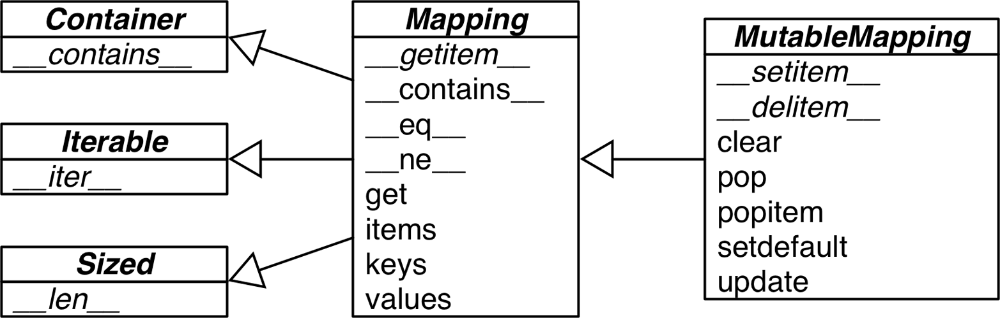

## Python notes

## General Notes

- This is an important Python API convention: functions or methods that change an object in place should return `None` to make it clear to the caller that the object itself was changed, and no new object was created. 
- In Python code, line breaks are ignored inside pairs of `[]`, `{}`, or `()`. So you can build multiline lists, listcomps, genexps, dictionaries and the like without using the ugly `\` line continuation escape.
- A search like `k in my_dict.keys()` is efficient in Python 3 even for very large mappings because `dict.keys()` returns a view, which is similar to a set, and containment checks in sets are as fast as in dictionaries. Details are documented in [the “Dictionary” view objects section of the documentation](http://bit.ly/1Vm7E4q). In Python 2, `dict.keys()` returns a `list`, so our solution also works there, but it is not efficient for large dictionaries, because `k in my_list` must scan the list.

### Sequences

- From Fluent Python, [*Fluent Python* code repository](https://github.com/fluentpython/example-code)

- Container sequences

`list`, `tuple`, and `collections.deque` can hold items of different types.

- Flat sequences

`str`, `bytes`, `bytearray`, `memoryview`, and `array.array` hold items of one type.

- Mutable sequences

```
list, bytearray, array.array, `collections.deque`, and `memoryview
```

- Immutable sequences

```python
tuple`, `str`, and `bytes
```

- list.sort and sorted

  ``` python
  list.sort returns None and sort in place
  sorted creates a new list
  ```

- List comprehensions build lists from sequences or any other iterable type by filtering and transforming items.

- Genexps use the same syntax as listcomps, but are enclosed in parentheses rather than brackets.

- Tuples

  - Tuples as records

  - ```python
    >>> lax_coordinates = (33.9425, -118.408056)  1
    >>> city, year, pop, chg, area = ('Tokyo', 2003, 32450, 0.66, 8014)  2
    >>> traveler_ids = [('USA', '31195855'), ('BRA', 'CE342567'),  3
    ...     ('ESP', 'XDA205856')]
    >>> for passport in sorted(traveler_ids):  4
    ...     print('%s/%s' % passport)   5
    ...
    BRA/CE342567
    ESP/XDA205856
    USA/31195855
    >>> for country, _ in traveler_ids:  6
    ...     print(country)
    ...
    USA
    BRA
    ESP
    ```

  - Tuple unpacking

    - Tuple unpacking works with any iterable object. The only requirement is that the iterable yields exactly one item per variable in the receiving tuple, unless you use a star (`*`) to capture excess items as explained in [“Using * to grab excess items”](https://learning.oreilly.com/library/view/fluent-python/9781491946237/ch02.html#tuple_star). The term *tuple unpacking* is widely used by Pythonistas, but *iterable unpacking* is gaining traction, as in the title of [PEP 3132 — Extended Iterable Unpacking](http://python.org/dev/peps/pep-3132/).

  - Named Tuples

    - Instances of a class that you build with `namedtuple` take exactly the same amount of memory as tuples because the field names are stored in the class. They use less memory than a regular object because they don’t store attributes in a per-instance `__dict__`.

    - ```Python
      >>> from collections import namedtuple
      >>> City = namedtuple('City', 'name country population coordinates')  1
      >>> tokyo = City('Tokyo', 'JP', 36.933, (35.689722, 139.691667))  2
      >>> tokyo
      City(name='Tokyo', country='JP', population=36.933, coordinates=(35.689722,
      139.691667))
      >>> tokyo.population  3
      36.933
      >>> tokyo.coordinates
      (35.689722, 139.691667)
      >>> tokyo[1]
      'JP'
      ```

    - Tuples as immutable list

    - Slicing

      - The Pythonic convention of excluding the last item in slices and ranges works well with the zero-based indexing used in Python, C, and many other languages.

      - Slice Object

      - ```Python
        >>> invoice = """
        ... 0.....6.................................40........52...55........
        ... 1909  Pimoroni PiBrella                     $17.50    3    $52.50
        ... 1489  6mm Tactile Switch x20                 $4.95    2     $9.90
        ... 1510  Panavise Jr. - PV-201                 $28.00    1    $28.00
        ... 1601  PiTFT Mini Kit 320x240                $34.95    1    $34.95
        ... """
        >>> SKU = slice(0, 6)
        >>> DESCRIPTION = slice(6, 40)
        >>> UNIT_PRICE = slice(40, 52)
        >>> QUANTITY =  slice(52, 55)
        >>> ITEM_TOTAL = slice(55, None)
        >>> line_items = invoice.split('\n')[2:]
        >>> for item in line_items:
        ...     print(item[UNIT_PRICE], item[DESCRIPTION])
        ...
            $17.50   Pimoroni PiBrella
             $4.95   6mm Tactile Switch x20
            $28.00   Panavise Jr. - PV-201
            $34.95   PiTFT Mini Kit 320x240
        ```

    - Building List of lists

    - 

- Dictionaries and Sets

  - Hashable

    - *An object is hashable if it has a hash value which never changes during its lifetime (it needs a* `__hash__()` *method), and can be compared to other objects (it needs an* `__eq__()` *method). Hashable objects which compare equal must have the same hash value. […]*
    - 

  - A search like `k in my_dict.keys()` is efficient in Python 3 even for very large mappings because `dict.keys()` returns a view, which is similar to a set, and containment checks in sets are as fast as in dictionaries. Details are documented in [the “Dictionary” view objects section of the documentation](http://bit.ly/1Vm7E4q). In Python 2, `dict.keys()` returns a `list`, so our solution also works there, but it is not efficient for large dictionaries, because `k in my_list` must scan the list.

  - Build dict

  - ```python
    >>> a = dict(one=1, two=2, three=3)
    >>> b = {'one': 1, 'two': 2, 'three': 3}
    >>> c = dict(zip(['one', 'two', 'three'], [1, 2, 3]))
    >>> d = dict([('two', 2), ('one', 1), ('three', 3)])
    >>> e = dict({'three': 3, 'one': 1, 'two': 2})
    >>> a == b == c == d == e
    True
    ```

  - dict comprehensions

    - ```python
      >>> DIAL_CODES = [                   
      ...         (86, 'China'),
      ...         (91, 'India'),
      ...         (1, 'United States'),
      ...         (62, 'Indonesia'),
      ...         (55, 'Brazil'),
      ...         (92, 'Pakistan'),
      ...         (880, 'Bangladesh'),
      ...         (234, 'Nigeria'),
      ...         (7, 'Russia'),
      ...         (81, 'Japan'),
      ...     ]
      >>> country_code = {country: code for code, country in DIAL_CODES}  
      >>> country_code
      {'China': 86, 'India': 91, 'Bangladesh': 880, 'United States': 1,
      'Pakistan': 92, 'Japan': 81, 'Russia': 7, 'Brazil': 55, 'Nigeria':
      234, 'Indonesia': 62}
      >>> {code: country.upper() for country, code in country_code.items()  
      ...  if code < 66}
      {1: 'UNITED STATES', 55: 'BRAZIL', 62: 'INDONESIA', 7: 'RUSSIA'}
      ```

  - Handling missing keys with setdefault

    - Every Pythonista knows that `d.get(k, default)` is an alternative to `d[k]` whenever a default value is more convenient than handling `KeyError`. However, when updating the value found (if it is mutable), using either `__getitem__` or `get` is awkward and inefficient

    - ```python
      my_dict.setdefault(key, []).append(new_value)
      ```

  - defaultdict

    - Here is how it works: when instantiating a `defaultdict`, you provide a callable that is used to produce a default value whenever `__getitem__` is passed a nonexistent key argument.

      For example, given an empty `defaultdict` created as `dd = defaultdict(list)`, if `'new-key'` is not in `dd`, the expression `dd['new-key']` does the following steps:

      1. Calls `list()` to create a new list.
      2. Inserts the list into `dd` using `'new-key'` as key.
      3. Returns a reference to that list.

    - The `default_factory` of a `defaultdict` is only invoked to provide default values for `__getitem__` calls, and not for the other methods. For example, if `dd` is a `defaultdict`, and `k` is a missing key, `dd[k]` will call the `default_factory` to create a default value, but `**dd.get(k)` still returns `None**`.

    - The \_\_missing\_\_ Method

      - This method is not defined in the base `dict` class, but `dict` is aware of it: if you subclass `dict` and provide a `__missing__` method, the standard `dict.__getitem__` will call it whenever a key is not found, instead of raising `KeyError`.

  - **Variations of dict**

    - **collections.OrderedDict** : Maintains keys in insertion order, allowing iteration over items in a predictable order. The `popitem` method of an `OrderedDict` pops the last item by default, but if called as `my_odict.popitem(last=False)`, it pops the first item added.

    - **collections.ChainMap**: Holds a list of mappings that can be searched as one. The lookup is performed on each mapping in order, and succeeds if the key is found in any of them. This is useful to interpreters for languages with nested scopes, where each mapping represents a scope context. [The “ChainMap objects” section of the `collections` docs](http://bit.ly/1Vm7I4c:) has several examples of `ChainMap` usage, including this snippet inspired by the basic rules of variable lookup in Python: 

      ```python
      import builtins
      pylookup = ChainMap(locals(), globals(), vars(builtins))
      ```

    - **collections.Counter**: A mapping that holds an integer count for each key. Updating an existing key adds to its count. This can be used to count instances of hashable objects (the keys) or as a multiset—a set that can hold several occurrences of each element. `Counter` implements the `+` and `-` operators to combine tallies, and other useful methods such as `most_common([n])`, which returns an ordered list of tuples with the *n* most common items and their counts; see the [documentation](http://bit.ly/1JHVi2E).

    - **collections.UserDict**. (designed to be subclassed): A pure Python implementation of a mapping that works like a standard `dict`.

      ```python
      import collections
      
      
      class StrKeyDict(collections.UserDict):  
      
          def __missing__(self, key):  
              if isinstance(key, str):
                  raise KeyError(key)
              return self[str(key)]
      
          def __contains__(self, key):
              return str(key) in self.data  
      
          def __setitem__(self, key, item):
              self.data[str(key)] = item   
      ```

      ```python
      class StrKeyDict0(dict):  
      
          def __missing__(self, key):
              if isinstance(key, str):  # if str(k) is not an existing key, we’d have an infinite recursion without this if statement
                  raise KeyError(key)
              return self[str(key)]   # would call __getitem__ passing that str key, which in turn would call __missing__ again
      
          def get(self, key, default=None):
              try:
                  return self[key]  
              except KeyError:
                  return default  
      
          def __contains__(self, key):
              return key in self.keys() or str(key) in self.keys()  
      ```

      Because `UserDict` subclasses `MutableMapping`, the remaining methods that make `StrKeyDict` a full-fledged mapping are inherited from `UserDict`, `MutableMapping`, or `Mapping`. The latter have several useful concrete methods, in spite of being abstract base classes (ABCs). The following methods are worth noting:

      - `MutableMapping.update`

        This powerful method can be called directly but is also used by `__init__` to load the instance from other mappings, from iterables of `(key, value)` pairs, and keyword arguments. Because it uses `self[key] = value` to add items, it ends up calling our implementation of `__setitem__`.

      - `Mapping.get`

        In `StrKeyDict0`, we had to code our own `get` to obtain results consistent with `__getitem__`, but in `StrKeyDict` we inherited `Mapping.get`, which is implemented exactly like `StrKeyDict0.get` (see [Python source code](http://bit.ly/1FEOPPB)).

  - 

- Arrays

  - If the list will only contain numbers, an `array.array` is more efficient than a `list`: it supports all mutable sequence operations (including `.pop`, `.insert`, and `.extend`), and additional methods for fast loading and saving such as `.frombytes` and `.tofile`.

- Set

  - Set elements must be hashable. The `set` type is not hashable, but `frozenset` is, so you can have `frozenset` elements inside a `set`.

### Pytest

**Monkeypatching with pytest (Example #1)**

The first example illustrates how to use monkeypatching with pytest involves changing the behavior of the getcwd() method (*Get Current Working Directory*) from the os module that is part of the Python standard library.

Here’s the source code to be tested:

```
def example1():
    """
    Retrieve the current directory

    Returns:
        Current directory
    """
    current_path = os.getcwd()
    return current_path
```

When testing this function, it would be desirable to be able to specify what ‘os.getcwd()’ returns instead of actually calling this function from the Python standard library.  By specifying what ‘os.getcwd()’ returns, you can write predictable tests and you can exercise different aspects of your code by returning off-nominal results.

Here’s the integration test that uses monkeypatching to specify a return value for ‘os.getcwd()’ in pytest:

```
def test_get_current_directory(monkeypatch):
    """
    GIVEN a monkeypatched version of os.getcwd()
    WHEN example1() is called
    THEN check the current directory returned
    """
    def mock_getcwd():
        return '/data/user/directory123'

    monkeypatch.setattr(os, 'getcwd', mock_getcwd)
    assert example1() == '/data/user/directory123'
```

This test function utilizes the ‘monkeypatch’ fixture that is part of pytest, which means that the ‘monkeypatch’ fixture is passed into the function as an argument.

The test function starts by creating a mock version of the getcwd() function (*the ‘mock_getcwd()’ function*) which returns a specified value.  This mock function is then set to be called when ‘os.getcwd()’ is called by using ‘monkeypatch.setattr()’.  What’s really nice about how pytest does monkeypatching is that this change to ‘os.getcwd()’ is only applicable within the ‘test_get_current_directory()’ function.

Finally, the test function does the actual check (ie. the assert call) to check that the value returned from ‘example1()’ matches the specified value.

**Monkeypatching with pytest (Example #2)**

The second example illustrates how to use monkeypatching with pytest when working with an external module, which happens to be the ‘[requests](http://docs.python-requests.org/en/master/)‘ module in this case.  The ‘requests’ module is an amazing python module that allows for easily working with HTTP requests.

Here’s the source code to be tested:

```
def example2():
    """
    Call GET for http://httpbin.org/get

    Returns:
        Status Code of the HTTP Response
        URL in the Text of the HTTP Response
    """
    r = requests.get(BASE_URL + 'get')

    if r.status_code == 200:
        response_data = r.json()
        return r.status_code, response_data["url"]    else:
        return r.status_code, ''
```

This function performs a GET to ‘http://httpbin.org/get’ and then checks that response. As an aside, [http://httpbin.org](http://httpbin.org/) is a great resource for testing API calls and it’s from the same author ([Kenneth Reitz](https://www.kennethreitz.org/)) that wrote the ‘requests’ module.

In order to test out this function, it would be desirable to be able to test the GET response being both *successful* and *failing*.  You can do this with monkeypatching in pytest!

Here’s the test function that tests the successful GET call:

```
def test_get_response_success(monkeypatch):
    """
    GIVEN a monkeypatched version of requests.get()
    WHEN the HTTP response is set to successful
    THEN check the HTTP response
    """
    class MockResponse(object):
        def __init__(self):
            self.status_code = 200
            self.url = 'http://httpbin.org/get'
            self.headers = {'blaa': '1234'}

        def json(self):
            return {'account': '5678',
                    'url': 'http://www.testurl.com'}

    def mock_get(url):
        return MockResponse()

    monkeypatch.setattr(requests, 'get', mock_get)
    assert example2() == (200, 'http://www.testurl.com')
```

Just like in the first example, this test function utilizes the ‘monkeypatch’ fixture that is part of pytest, which means that the ‘monkeypatch’ fixture is passed into the function as an argument.

The test function starts by creating a new class (‘MockResponse’) that specifies fixed values to be returned from an HTTP response.  An instance of this class is then returned by the ‘mock_get()’ function.

This mock function (‘mock_get()’) is then set to be called when ‘requests.get()’ is called by using ‘monkeypatch.setattr()’.

Finally, the actual check (ie. the assert call) is performed to check that the returned values from ‘example2()’ are the expected values.

A failed HTTP GET response can be tested in a similar manner:

```
def test_get_response_failure(monkeypatch):
    """
    GIVEN a monkeypatched version of requests.get()
    WHEN the HTTP response is set to failed
    THEN check the HTTP response
    """
    class MockResponse(object):
        def __init__(self):
            self.status_code = 404
            self.url = 'http://httpbin.org/get'
            self.headers = {'blaa': '1234'}

        def json(self):
            return {'error': 'bad'}

    def mock_get(url):
        return MockResponse()

    monkeypatch.setattr(requests, 'get', mock_get)
    assert example2() == (404, '')
```

This test function is similar to the success case, except it is now returning a status code of 404 (Internal Server Error) to test that the negative path in ‘example2()’ works as expected.

- [Mock](https://codefellows.github.io/sea-python-401d7/lectures/mock.html)

  - MagicMock and Faking Object

  - ```python
    def some_view(request):
        if request.method == "GET":
            return {}
        if request.method == "POST":
            new_entry = Entry(
                title = request.POST['title'],
                body = request.POST['body']
            )
            request.dbsession.add(new_entry)
            return HTTPFound(request.route_url('entry_list'))
    ```

    ```python
    def test_some_view_get_req_returns_dict(mocker):
        from views import some_view
        req = mocker.MagicMock()
        req.method = 'GET'
        assert some_view(req) == {}
    def test_some_view_post_returns_redirect(mocker):
        from views import some_view
        req = mocker.MagicMock()
        req.method = 'POST'
        req.POST = {'title': 'some title', 'body': 'some body text'}
        req.dbsession.add = lambda arg: None
        assert isinstance(some_view(req), HTTPFound)
    ```