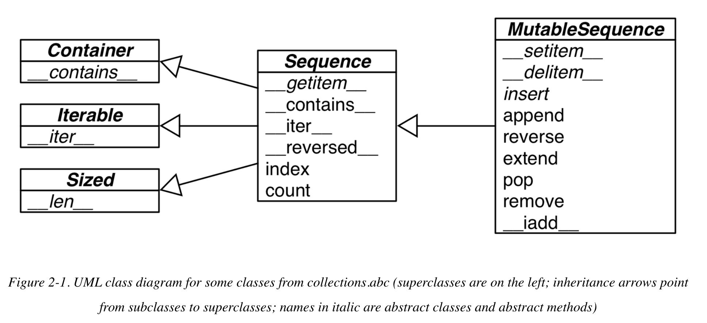

## Python notes

## General Notes

- This is an important Python API convention: functions or methods that change an object in place should return `None` to make it clear to the caller that the object itself was changed, and no new object was created. 
- In Python code, line breaks are ignored inside pairs of `[]`, `{}`, or `()`. So you can build multiline lists, listcomps, genexps, dictionaries and the like without using the ugly `\` line continuation escape.
- A search like `k in my_dict.keys()` is efficient in Python 3 even for very large mappings because `dict.keys()` returns a view, which is similar to a set, and containment checks in sets are as fast as in dictionaries. Details are documented in [the “Dictionary” view objects section of the documentation](http://bit.ly/1Vm7E4q). In Python 2, `dict.keys()` returns a `list`, so our solution also works there, but it is not efficient for large dictionaries, because `k in my_list` must scan the list.

### Sequences

- From Fluent Python, [*Fluent Python* code repository](https://github.com/fluentpython/example-code)
- 
- Container sequences

`list`, `tuple`, and `collections.deque` can hold items of different types.

- Flat sequences

`str`, `bytes`, `bytearray`, `memoryview`, and `array.array` hold items of one type.

- Mutable sequences

```
list, bytearray, array.array, `collections.deque`, and `memoryview
```

- Immutable sequences

```python
tuple, str, and bytes
```

- list.sort and sorted

  ``` python
  list.sort returns None and sort in place
  sorted creates a new list
  ```

- List comprehensions build lists from sequences or any other iterable type by filtering and transforming items.

- Genexps use the same syntax as listcomps, but are enclosed in parentheses rather than brackets.

- Tuples

  - Tuples as records

  - ```python
    >>> lax_coordinates = (33.9425, -118.408056)  1
    >>> city, year, pop, chg, area = ('Tokyo', 2003, 32450, 0.66, 8014)  2
    >>> traveler_ids = [('USA', '31195855'), ('BRA', 'CE342567'),  3
    ...     ('ESP', 'XDA205856')]
    >>> for passport in sorted(traveler_ids):  4
    ...     print('%s/%s' % passport)   5
    ...
    BRA/CE342567
    ESP/XDA205856
    USA/31195855
    >>> for country, _ in traveler_ids:  6
    ...     print(country)
    ...
    USA
    BRA
    ESP
    ```

  - Tuple unpacking

    - Tuple unpacking works with any iterable object. The only requirement is that the iterable yields exactly one item per variable in the receiving tuple, unless you use a star (`*`) to capture excess items as explained in [“Using * to grab excess items”](https://learning.oreilly.com/library/view/fluent-python/9781491946237/ch02.html#tuple_star). The term *tuple unpacking* is widely used by Pythonistas, but *iterable unpacking* is gaining traction, as in the title of [PEP 3132 — Extended Iterable Unpacking](http://python.org/dev/peps/pep-3132/).

  - Named Tuples

    - Instances of a class that you build with `namedtuple` take exactly the same amount of memory as tuples because the field names are stored in the class. They use less memory than a regular object because they don’t store attributes in a per-instance `__dict__`.

    - ```Python
      >>> from collections import namedtuple
      >>> City = namedtuple('City', 'name country population coordinates')  1
      >>> tokyo = City('Tokyo', 'JP', 36.933, (35.689722, 139.691667))  2
      >>> tokyo
      City(name='Tokyo', country='JP', population=36.933, coordinates=(35.689722,
      139.691667))
      >>> tokyo.population  3
      36.933
      >>> tokyo.coordinates
      (35.689722, 139.691667)
      >>> tokyo[1]
      'JP'
      ```

    - Tuples as immutable list

    - Slicing

      - The Pythonic convention of excluding the last item in slices and ranges works well with the zero-based indexing used in Python, C, and many other languages.

      - Slice Object

      - ```Python
        >>> invoice = """
        ... 0.....6.................................40........52...55........
        ... 1909  Pimoroni PiBrella                     $17.50    3    $52.50
        ... 1489  6mm Tactile Switch x20                 $4.95    2     $9.90
        ... 1510  Panavise Jr. - PV-201                 $28.00    1    $28.00
        ... 1601  PiTFT Mini Kit 320x240                $34.95    1    $34.95
        ... """
        >>> SKU = slice(0, 6)
        >>> DESCRIPTION = slice(6, 40)
        >>> UNIT_PRICE = slice(40, 52)
        >>> QUANTITY =  slice(52, 55)
        >>> ITEM_TOTAL = slice(55, None)
        >>> line_items = invoice.split('\n')[2:]
        >>> for item in line_items:
        ...     print(item[UNIT_PRICE], item[DESCRIPTION])
        ...
            $17.50   Pimoroni PiBrella
             $4.95   6mm Tactile Switch x20
            $28.00   Panavise Jr. - PV-201
            $34.95   PiTFT Mini Kit 320x240
        ```

    - Building List of lists

    - https://stackoverflow.com/questions/2970608/what-are-named-tuples-in-python

- Arrays

  - If the list will only contain numbers, an `array.array` is more efficient than a `list`: it supports all mutable sequence operations (including `.pop`, `.insert`, and `.extend`), and additional methods for fast loading and saving such as `.frombytes` and `.tofile`.

  - 

- Dictionaries and Sets

  - Hashable

    - *An object is hashable if it has a hash value which never changes during its lifetime (it needs a* `__hash__()` *method), and can be compared to other objects (it needs an* `__eq__()` *method). Hashable objects which compare equal must have the same hash value. […]*
    - 

  - A search like `k in my_dict.keys()` is efficient in Python 3 even for very large mappings because `dict.keys()` returns a view, which is similar to a set, and containment checks in sets are as fast as in dictionaries. Details are documented in [the “Dictionary” view objects section of the documentation](http://bit.ly/1Vm7E4q). In Python 2, `dict.keys()` returns a `list`, so our solution also works there, but it is not efficient for large dictionaries, because `k in my_list` must scan the list.

  - Build dict

  - ```python
    >>> a = dict(one=1, two=2, three=3)
    >>> b = {'one': 1, 'two': 2, 'three': 3}
    >>> c = dict(zip(['one', 'two', 'three'], [1, 2, 3]))
    >>> d = dict([('two', 2), ('one', 1), ('three', 3)])
    >>> e = dict({'three': 3, 'one': 1, 'two': 2})
    >>> a == b == c == d == e
    True
    ```

  - dict comprehensions

    - ```python
      >>> DIAL_CODES = [                   
      ...         (86, 'China'),
      ...         (91, 'India'),
      ...         (1, 'United States'),
      ...         (62, 'Indonesia'),
      ...         (55, 'Brazil'),
      ...         (92, 'Pakistan'),
      ...         (880, 'Bangladesh'),
      ...         (234, 'Nigeria'),
      ...         (7, 'Russia'),
      ...         (81, 'Japan'),
      ...     ]
      >>> country_code = {country: code for code, country in DIAL_CODES}  
      >>> country_code
      {'China': 86, 'India': 91, 'Bangladesh': 880, 'United States': 1,
      'Pakistan': 92, 'Japan': 81, 'Russia': 7, 'Brazil': 55, 'Nigeria':
      234, 'Indonesia': 62}
      >>> {code: country.upper() for country, code in country_code.items()  
      ...  if code < 66}
      {1: 'UNITED STATES', 55: 'BRAZIL', 62: 'INDONESIA', 7: 'RUSSIA'}
      ```

  - ##### Handling missing keys with **setdefault**

    - Every Pythonista knows that `d.get(k, default)` is an alternative to `d[k]` whenever a default value is more convenient than handling `KeyError`. However, when updating the value found (if it is mutable), using either `__getitem__` or `get` is awkward and inefficient

    - ```python
      my_dict.setdefault(key, []).append(new_value)
      ```

  - defaultdict

    - Here is how it works: when instantiating a `defaultdict`, you provide a callable that is used to produce a default value whenever `__getitem__` is passed a nonexistent key argument.

      For example, given an empty `defaultdict` created as `dd = defaultdict(list)`, if `'new-key'` is not in `dd`, the expression `dd['new-key']` does the following steps:

      1. Calls `list()` to create a new list.
      2. Inserts the list into `dd` using `'new-key'` as key.
      3. Returns a reference to that list.

    - The `default_factory` of a `defaultdict` is only invoked to provide default values for `__getitem__` calls, and not for the other methods. For example, if `dd` is a `defaultdict`, and `k` is a missing key, `dd[k]` will call the `default_factory` to create a default value, but `**dd.get(k)` still returns `None**`.

    - The \_\_missing\_\_ Method

      - This method is not defined in the base `dict` class, but `dict` is aware of it: if you subclass `dict` and provide a `__missing__` method, the standard `dict.__getitem__` will call it whenever a key is not found, instead of raising `KeyError`.

  - **Variations of dict**

    - **collections.OrderedDict** : Maintains keys in insertion order, allowing iteration over items in a predictable order. The `popitem` method of an `OrderedDict` pops the last item by default, but if called as `my_odict.popitem(last=False)`, it pops the first item added.

    - **collections.ChainMap**: Holds a list of mappings that can be searched as one. The lookup is performed on each mapping in order, and succeeds if the key is found in any of them. This is useful to interpreters for languages with nested scopes, where each mapping represents a scope context. [The “ChainMap objects” section of the `collections` docs](http://bit.ly/1Vm7I4c:) has several examples of `ChainMap` usage, including this snippet inspired by the basic rules of variable lookup in Python: 

      ```python
      import builtins
      pylookup = ChainMap(locals(), globals(), vars(builtins))
      ```

    - **collections.Counter**: A mapping that holds an integer count for each key. Updating an existing key adds to its count. This can be used to count instances of hashable objects (the keys) or as a multiset—a set that can hold several occurrences of each element. `Counter` implements the `+` and `-` operators to combine tallies, and other useful methods such as `most_common([n])`, which returns an ordered list of tuples with the *n* most common items and their counts; see the [documentation](http://bit.ly/1JHVi2E).

    - **collections.UserDict**. (designed to be subclassed): A pure Python implementation of a mapping that works like a standard `dict`.

      ```python
      import collections
      
      
      class StrKeyDict(collections.UserDict):  
      
          def __missing__(self, key):  
              if isinstance(key, str):
                  raise KeyError(key)
              return self[str(key)]
      
          def __contains__(self, key):
              return str(key) in self.data  
      
          def __setitem__(self, key, item):
              self.data[str(key)] = item   
      ```

      ```python
      class StrKeyDict0(dict):  
      
          def __missing__(self, key):
              if isinstance(key, str):  # if str(k) is not an existing key, we’d have an infinite recursion without this if statement
                  raise KeyError(key)
              return self[str(key)]   # would call __getitem__ passing that str key, which in turn would call __missing__ again
      
          def get(self, key, default=None):
              try:
                  return self[key]  
              except KeyError:
                  return default  
      
          def __contains__(self, key):
              return key in self.keys() or str(key) in self.keys()  
      ```

      Because `UserDict` subclasses `MutableMapping`, the remaining methods that make `StrKeyDict` a full-fledged mapping are inherited from `UserDict`, `MutableMapping`, or `Mapping`. The latter have several useful concrete methods, in spite of being abstract base classes (ABCs). The following methods are worth noting:

      - `MutableMapping.update`

        This powerful method can be called directly but is also used by `__init__` to load the instance from other mappings, from iterables of `(key, value)` pairs, and keyword arguments. Because it uses `self[key] = value` to add items, it ends up calling our implementation of `__setitem__`.

      - `Mapping.get`

        In `StrKeyDict0`, we had to code our own `get` to obtain results consistent with `__getitem__`, but in `StrKeyDict` we inherited `Mapping.get`, which is implemented exactly like `StrKeyDict0.get` (see [Python source code](http://bit.ly/1FEOPPB)).

  - KEYS MUST BE HASHABLE OBJECTS

    An object is hashable if all of these requirements are met:

    1. It supports the `hash()` function via a `__hash__()` method that always returns the same value over the lifetime of the object.
    2. It supports equality via an `__eq__()` method.
    3. If `a == b` is `True` then `hash(a) == hash(b)` must also be `True`.

  - If you implement a class with a custom `__eq__` method, and you want the instances to be hashable, you must also implement a suitable `__hash__`, to make sure that when `a == b` is `True` then `hash(a) == hash(b)` is also `True`. Otherwise you are breaking an invariant of the hash table algorithm, with the grave consequence that dicts and sets will not handle your objects reliably. On the other hand, if a class has a custom `__eq$__` that depends on mutable state, its instances are not hashable and you must never implement a `__hash__` method in such a class.

  - DICTS HAVE SIGNIFICANT MEMORY OVERHEAD

- Set

  - Set elements must be **hashable**. The `set` type is not hashable, but `frozenset` is, so you can have `frozenset` elements inside a `set`.
  - In addition to guaranteeing uniqueness, the set types implement the essential set operations as infix operators, so, given two sets `a` and `b`, `a | b` returns their union, `a & b` computes the intersection, and `a - b` the difference. Smart use of set operations can reduce both the line count and the runtime of Python programs, at the same time making code easier to read and reason about—by removing loops and lots of conditional logic.
  - Set literals: The syntax of `set` literals—`{1}`, `{1, 2}`, etc.—looks exactly like the math notation, with one important exception: there’s no literal notation for the empty `set`, so we must remember to write `set()`.

- Functions and Objects

  - ## Modern Replacements for map, filter, and reduce

    Functional languages commonly offer the `map`, `filter`, and `reduce` higher-order functions (sometimes with different names). The `map` and `filter` functions are still built-ins in Python 3, but since the introduction of list comprehensions and generator expressions, they are not as important. A listcomp or a genexp does the job of `map` and `filter` combined, but is more readable. Consider example below.

    ```python
    list(map(fact, range(6)))  
      [1, 1, 2, 6, 24, 120]
    [fact(n) for n in range(6)]  
      [1, 1, 2, 6, 24, 120]
    list(map(factorial, filter(lambda n: n % 2, range(6))))  
    [1, 6, 120]
    [factorial(n) for n in range(6) if n % 2]  
      [1, 6, 120]
    ```
  
    In Python 3, `map` and `filter` return generators—a form of iterator—so their direct substitute is now a generator expression (in Python 2, these functions returned lists, therefore their closest alternative is a listcomp).
  
    The `reduce` function was demoted from a built-in in Python 2 to the `functools` module in Python 3. Its most common use case, summation, is better served by the `sum` built-in available since Python 2.3 was released in 2003. This is a big win in terms of readability and performance
  
  - Lambdas: rarely useful in Python
  
  - ##### LUNDH’S LAMBDA REFACTORING RECIPE
  
    If you find a piece of code hard to understand because of a `lambda`, Fredrik Lundh suggests this refactoring procedure:
  
    1. Write a comment explaining what the heck that `lambda` does.
    2. Study the comment for a while, and think of a name that captures the essence of the comment.
    3. Convert the `lambda` to a `def` statement, using that name.
    4. Remove the comment.
  
    These steps are quoted from the [Functional Programming HOWTO](http://docs.python.org/3/howto/functional.html), a must read.
    
  - the Seven Flavors of Callable Objects
  
    - **User-defined functions**: Created with `def` statements or `lambda` expressions.
  
    - **Built-in functions**: A function implemented in C (for CPython), like `len` or `time.strftime`.
  
    - **Built-in methods:** Methods implemented in C, like `dict.get`.
  
    - **Methods**: Functions defined in the body of a class.
  
    - **Classes**
  
      When invoked, a class runs its `__new__` method to create an instance, then `__init__` to initialize it, and finally the instance is returned to the caller. Because there is no `new` operator in Python, calling a class is like calling a function. (Usually calling a class creates an instance of the same class, but other behaviors are possible by overriding `__new__`. We’ll see an example of this in [“Flexible Object Creation with __new__”](https://learning.oreilly.com/library/view/fluent-python/9781491946237/ch19.html#flexible_new_sec).)
  
    - **Class instances**
  
      If a class defines a `__call__` method, then its instances may be invoked as functions. See [“User-Defined Callable Types”](https://learning.oreilly.com/library/view/fluent-python/9781491946237/ch05.html#user_callables).
  
    - **Generator functions**
  
      Functions or methods that use the `yield` keyword. When called, generator functions return a generator object.
  
  - Introspection of module example
  
  - ```Python
    promos = [func for name, func in
                    inspect.getmembers(promotions, inspect.isfunction)]
    
    def best_promo(order):
        """Select best discount available
        """
        return max(promo(order) for promo in promos)
    ```
  
  - Function Introspection 
  
    - List attributes of function that don't exist in plain instances
  
    - ```Python
      >>> class C: pass  #1 create a bare user defined class
      >>> obj = C()  #2 make an instance of it
      >>> def func(): pass  #3 create a bare function
      >>> sorted(set(dir(func)) - set(dir(obj))) #4 using set diff, generate a sorted list
      ['__annotations__', '__call__', '__closure__', '__code__', '__defaults__',
      '__get__', '__globals__', '__kwdefaults__', '__name__', '__qualname__']
      ```
  
  - # Packages for Functional Programming
  
    - The operator module: To save you the trouble of writing trivial anonymous functions like `lambda a, b: a*b`, the `operator` module provides function equivalents for dozens of arithmetic operators. 
  
    - ```python
      from functools import reduce
      from operator import mul
      
      def fact(n):
          return reduce(mul, range(1, n+1))
      ```
    
    - Another group of one-trick lambdas that `operator` replaces are functions to pick items from sequences or read attributes from objects: `itemgetter` and `attrgetter` actually build custom functions to do that.
    
    - ```python
      
      ```
    >>> metro_data = [
    >>>   ...     ('Tokyo', 'JP', 36.933, (35.689722, 139.691667)),
    >>> ...     ('Delhi NCR', 'IN', 21.935, (28.613889, 77.208889)),
    >>>   ...     ('Mexico City', 'MX', 20.142, (19.433333, -99.133333)),
    >>>   ...     ('New York-Newark', 'US', 20.104, (40.808611, -74.020386)),
    >>>   ...     ('Sao Paulo', 'BR', 19.649, (-23.547778, -46.635833)),
    >>>   ... ]
    >>>
    >>> from operator import itemgetter
    >>> for city in sorted(metro_data, key=itemgetter(1)):
    >>>   ...     print(city)
    >>>   ...
    >>>   ('Sao Paulo', 'BR', 19.649, (-23.547778, -46.635833))
    >>>   ('Delhi NCR', 'IN', 21.935, (28.613889, 77.208889))
    >>>   ('Tokyo', 'JP', 36.933, (35.689722, 139.691667))
    >>>   ('Mexico City', 'MX', 20.142, (19.433333, -99.133333))
    >>>   ('New York-Newark', 'US', 20.104, (40.808611, -74.020386))
    >>> from operator import methodcaller
    >>> s = 'The time has come'
    >>> upcase = methodcaller('upper')
    >>> upcase(s)
    >>>   'THE TIME HAS COME'
    >>> hiphenate = methodcaller('replace', ' ', '-')
    >>> hiphenate(s)
    >>>   'The-time-has-come'
    >>>
    >>>   ```
    >>> 
    >>>   ```
    
    - ## Freezing Arguments with functools.partial
    
    - ```python
      >>> from operator import mul
      >>> from functools import partial
      ```
    >>> triple = partial(mul, 3)  # 1
    >>> triple(7)  # 2
    >>> 21
    >>> list(map(triple, range(1, 10)))  # 3
    >>>   [3, 6, 9, 12, 15, 18, 21, 24, 27]
    >>>
    >>>   ```
    >>> 
    >>>   ```
    
    - 
    
  - Function Decorators and Closures
  
    - Decorator 101
  
      - ```python
        @decorate
        def target():
            print('running target()')
            
        # Effectively the above code is the same as code below
        def target():
            print('running target()')
        
        target = decorate(target)
        ```
  
      - A key feature of decorators is that they run right after the decorated function is defined. That is usually at *import time*. **Function decorators are executed as soon as the module is imported, but the decorated functions only run when they are explicitly invoked**. This highlights the difference between what Pythonistas call *import time* and *runtime*. e.g.
  
      - ```python
        registry = []  #1
        
        def register(func):  #2
            print('running register(%s)' % func)  3
            registry.append(func)  #4
            return func  #5 not typical but used in some frameworks
        
        @register  #6
        def f1():
            print('running f1()')
        
        @register
        def f2():
            print('running f2()')
        
        def f3():  #7 Not decorated
            print('running f3()')
        
        def main():  #8
            print('running main()')
            print('registry ->', registry)
            f1()
            f2()
            f3()
        
        if __name__=='__main__':
            main()  #9
        ```
  
      - Variable Scope Rules: Local reference to global variable need to be declared 
  
      - ```python
        b = 6
        >>> def f2(a):
        ...     # global b
        ...     print(a)
        ...     print(b)
        ...     b = 9
        ...
        >>> f2(3)
        3
        Traceback (most recent call last):
          File "<stdin>", line 1, in <module>
          File "<stdin>", line 3, in f2
        UnboundLocalError: local variable 'b' referenced before assignment
        ```
  
        - The `dis` module provides an easy way to disassemble the bytecode of Python functions.
  
      - Closures: a closure is a function with an extended scope that encompasses nonglobal variables referenced in the body of the function but not defined there. It does not matter whether the function is anonymous or not; what matters is that it can access nonglobal variables that are defined outside of its body
  
      - ```python
        # a better version below
        def make_averager():
            series = []
        
            def averager(new_value):
                series.append(new_value)
                total = sum(series)
                return total/len(series)
        
            return averager
        >>> avg = make_averager()
        >>> avg(10)
        10.0
        >>> avg(11)
        10.5
        >>> avg(12)
        11.0
        >>> avg.__code__.co_varnames
        ('new_value', 'total')
        >>> avg.__code__.co_freevars
        ('series',)
        
        >>> avg.__code__.co_freevars
        ('series',)
        >>> avg.__closure__
        (<cell at 0x107a44f78: list object at 0x107a91a48>,)
        >>> avg.__closure__[0].cell_contents
        [10, 11, 12]
        
        def make_averager():
            count = 0
            total = 0
        
            def averager(new_value):
                nonlocal count, total
                count += 1
                total += new_value
                return total / count
        
            return averager
        ```
  
      - Decorators (see [more](https://github.com/GrahamDumpleton/wrapt/blob/develop/blog/README.md)). [How you implemented your python decorator is wrong](https://github.com/GrahamDumpleton/wrapt/blob/develop/blog/01-how-you-implemented-your-python-decorator-is-wrong.md)
  
      - ```python
        import time
        
        def clock(func):
            def clocked(*args):  # 1. Define inner function clocked to accept any number of positional arguments.
                t0 = time.perf_counter()
                result = func(*args)  #2.This line only works because the closure for clocked encompasses the func free variable.
                elapsed = time.perf_counter() - t0
                name = func.__name__
                arg_str = ', '.join(repr(arg) for arg in args)
                print('[%0.8fs] %s(%s) -> %r' % (elapsed, name, arg_str, result))
                return result
            return clocked  # 3. Return the inner function to replace the decorated function.
        
        # better version
        import time
        import functools
        
        def clock(func):
            @functools.wraps(func)
            def clocked(*args, **kwargs):
                t0 = time.time()
                result = func(*args, **kwargs)
                elapsed = time.time() - t0
                name = func.__name__
                arg_lst = []
                if args:
                    arg_lst.append(', '.join(repr(arg) for arg in args))
                if kwargs:
                    pairs = ['%s=%r' % (k, w) for k, w in sorted(kwargs.items())]
                    arg_lst.append(', '.join(pairs))
                arg_str = ', '.join(arg_lst)
                print('[%0.8fs] %s(%s) -> %r ' % (elapsed, name, arg_str, result))
                return result
            return clocked
        ```
  
        - ```python
          class function_wrapper(object):
              def __init__(self, wrapped):
                  self.wrapped = wrapped
                  functools.update_wrapper(self, wrapped)
              def __call__(self, *args, **kwargs):
                  return self.wrapped(*args, **kwargs)
          
          @function_wrapper
          def function():
              pass
          ```
  
        - Standard library decorators: functools.wraps, functools.lru_cache, functools.singledispatch
  
          - lru_cache
  
          - ```python
            functools.lru_cache(maxsize=128, typed=False)
            ```
  
          - singledispatch: A notable quality of the `singledispatch` mechanism is that you can register specialized functions **anywhere in the system**, in any module. If you later add a module with a new user-defined type, you can easily provide a new custom function to handle that type. And you can write custom functions for classes that you did not write and can’t change.
  
          - ```python
            #singledispatch creates a custom htmlize.register to bundle several functions into a generic function
            from functools import singledispatch
            from collections import abc
            import numbers
            import html
            
            @singledispatch  # 1. @singledispatch marks the base function that handles the object type.
            def htmlize(obj):
                content = html.escape(repr(obj))
                return '<pre>{}</pre>'.format(content)
            
            @htmlize.register(str)  # 2. Each specialized function is decorated with @«base_function».register(«type»).
            def _(text):            # 3. The name of the specialized functions is irrelevant; _ is a good choice to make this clear.
                content = html.escape(text).replace('\n', '<br>\n')
                return '<p>{0}</p>'.format(content)
            
            @htmlize.register(numbers.Integral)  # 4. For each additional type to receive special treatment, register a new function. numbers.Integral is a virtual superclass of int
            def _(n):
                return '<pre>{0} (0x{0:x})</pre>'.format(n)
            
            @htmlize.register(tuple)  # 5. You can stack several register decorators to support different types with the same function.
            @htmlize.register(abc.MutableSequence)
            def _(seq):
                inner = '</li>\n<li>'.join(htmlize(item) for item in seq)
                return '<ul>\n<li>' + inner + '</li>\n</ul>'
            ```
  
        - Stacked Decorators
  
        - ```python
          @d1
          @d2
          def f():
              print('f')
              
          # the same as
          def f():
              print('f')
          
          f = d1(d2(f))
          ```
  
        - Parameterized decorators
  
        - ```python
          import time
          
          DEFAULT_FMT = '[{elapsed:0.8f}s] {name}({args}) -> {result}'
          
          def clock(fmt=DEFAULT_FMT):  1
              def decorate(func):      2
                  def clocked(*_args): 3
                      t0 = time.time()
                      _result = func(*_args)  4
                      elapsed = time.time() - t0
                      name = func.__name__
                      args = ', '.join(repr(arg) for arg in _args)  5
                      result = repr(_result)  6
                      print(fmt.format(**locals()))  # 7. Using **locals() here allows any local variable of clocked to be referenced in the fmt.
                      return _result  8
                  return clocked  9
              return decorate  10
          
          if __name__ == '__main__':
          
              @clock()  11
              def snooze(seconds):
                  time.sleep(seconds)
          
              for i in range(3):
                  snooze(.123)
          ```
  
      - Object references, Mutability and Recycling
      
        - To understand an assignment in Python, always read the right-hand side first: that’s where the object is created or retrieved. After that, the variable on the left is bound to the object, like a label stuck to it. Just forget about the boxes
      
        - *Every object has an identity, a type and a value. An object’s identity never changes once it has been created; you may think of it as the object’s address in memory. The* `is` *operator compares the identity of two objects; the* `id()` *function returns an integer representing its identity.*
      
        - ```python
          >>> charles = {'name': 'Charles L. Dodgson', 'born': 1832}
          >>> lewis = charles  #1
          >>> lewis is charles
          True
          >>> id(charles), id(lewis)  #2
          (4300473992, 4300473992)
          >>> lewis['balance'] = 950  #3
          >>> charles
          {'name': 'Charles L. Dodgson', 'balance': 950, 'born': 1832}
          >>> alex = {'name': 'Charles L. Dodgson', 'born': 1832, 'balance': 950}  #1
          >>> alex == charles  2
          True
          >>> alex is not charles  3
          True
          
          ```
      
        - The `is` operator is faster than `==`, because it cannot be overloaded, so Python does not have to find and invoke special methods to evaluate it, and computing is as simple as comparing two integer IDs.
      
        - Copies are shallow by default
      
        - ```python
          >>> l1 = [3, [55, 44], (7, 8, 9)]
          >>> l2 = list(l1)  1
          >>> l2
          [3, [55, 44], (7, 8, 9)]
          >>> l2 == l1  2
          True
          >>> l2 is l1  3
          False
          l1 = [3, [66, 55, 44], (7, 8, 9)]
          l2 = list(l1)      1
          l1.append(100)     2
          l1[1].remove(55)   3
          print('l1:', l1)
          print('l2:', l2)
          l2[1] += [33, 22]  4
          l2[2] += (10, 11)  5
          print('l1:', l1)
          print('l2:', l2)
          ```
      
        - Function Parameters as References
      
          - The only mode of parameter passing in Python is *call by sharing*. That is the same mode used in most OO languages, including Ruby, SmallTalk, and Java (this applies to Java reference types; primitive types use call by value). Call by sharing means that each formal parameter of the function gets a copy of each reference in the arguments. In other words, the parameters inside the function become aliases of the actual arguments.
      
          - ```python
            >>> def f(a, b):
            ...     a += b
            ...     return a
            ...
            >>> x = 1
            >>> y = 2
            >>> f(x, y)
            3
            >>> x, y  #1
            (1, 2)
            >>> a = [1, 2]
            >>> b = [3, 4]
            >>> f(a, b)
            [1, 2, 3, 4]
            >>> a, b  #2
            ([1, 2, 3, 4], [3, 4])
            >>> t = (10, 20)
            >>> u = (30, 40)
            >>> f(t, u)  #3
            (10, 20, 30, 40)
            >>> t, u
            ((10, 20), (30, 40))
            ```
      
          - ## Mutable Types as Parameter Defaults: Bad Idea
      
            - ## Defensive Programming with Mutable Parameters
      
            - Unless a method is explicitly intended to mutate an object received as argument, you should think twice before aliasing the argument object by simply assigning it to an instance variable in your class. If in doubt, make a copy. Your clients will often be happier.
      
          - ```python
            class HauntedBus:
                """A bus model haunted by ghost passengers"""
            
                def __init__(self, passengers=[]):  1
                    self.passengers = passengers  2
            
                def pick(self, name):
                    self.passengers.append(name)  3
            
                def drop(self, name):
                    self.passengers.remove(name)
                    
            >>> bus1 = HauntedBus(['Alice', 'Bill'])
            >>> bus1.passengers
            ['Alice', 'Bill']
            >>> bus1.pick('Charlie')
            >>> bus1.drop('Alice')
            >>> bus1.passengers  1
            ['Bill', 'Charlie']
            >>> bus2 = HauntedBus()  2
            >>> bus2.pick('Carrie')
            >>> bus2.passengers
            ['Carrie']
            >>> bus3 = HauntedBus()  3
            >>> bus3.passengers  4
            ['Carrie']
            >>> bus3.pick('Dave')
            >>> bus2.passengers  5
            ['Carrie', 'Dave']
            >>> bus2.passengers is bus3.passengers  6
            True
            >>> bus1.passengers  7
            ['Bill', 'Charlie']
            
            >>> dir(HauntedBus.__init__)  # doctest: +ELLIPSIS
            ['__annotations__', '__call__', ..., '__defaults__', ...]
            >>> HauntedBus.__init__.__defaults__
            (['Carrie', 'Dave'],)
            >>> HauntedBus.__init__.__defaults__[0] is bus2.passengers
            True
            ```
      
          - # classmethod Versus staticmethod
      
            The `classmethod` decorator is not mentioned in the Python tutorial, and neither is `staticmethod`. Anyone who has learned OO in Java may wonder why Python has both of these decorators and not just one of them.
      
            Let’s start with `classmethod`. [Example 9-3](https://learning.oreilly.com/library/view/fluent-python/9781491946237/ch09.html#ex_vector2d_v1) shows its use: to define a method that operates on the class and not on instances. `classmethod` changes the way the method is called, so it receives the class itself as the first argument, instead of an instance. Its most common use is for alternative constructors, like `frombytes` in [Example 9-3](https://learning.oreilly.com/library/view/fluent-python/9781491946237/ch09.html#ex_vector2d_v1). Note how the last line of `frombytes` actually uses the `cls` argument by invoking it to build a new instance: `cls(*memv)`. By convention, the first parameter of a class method should be named `cls` (but Python doesn’t care how it’s named).
      
            In contrast, the `staticmethod` decorator changes a method so that it receives no special first argument. In essence, a static method is just like a plain function that happens to live in a class body, instead of being defined at the module level. [Example 9-4](https://learning.oreilly.com/library/view/fluent-python/9781491946237/ch09.html#ex_class_staticmethod) contrasts the operation of `classmethod` and `staticmethod`.
      
            ```python
            >>> class Demo:
            ...     @classmethod
            ...     def klassmeth(*args):
            ...         return args  #1
            ...     @staticmethod
            ...     def statmeth(*args):
            ...         return args  #2
            ...
            >>> Demo.klassmeth()  #3
            (<class '__main__.Demo'>,)
            >>> Demo.klassmeth('spam')
            (<class '__main__.Demo'>, 'spam')
            >>> Demo.statmeth()   #4
            ()
            >>> Demo.statmeth('spam')
            ('spam',)
            ```
      
        - The `__getattr__` method is invoked by the interpreter when attribute lookup fails. In simple terms, given the expression `my_obj.x`, Python checks if the `my_obj` instance has an attribute named `x`; if not, the search goes to the class (`my_obj.__class__`), and then up the inheritance graph.[2](https://learning.oreilly.com/library/view/fluent-python/9781491946237/ch10.html#idm139636514050864) If the `x` attribute is not found, then the `__getattr__` method defined in the class of `my_obj` is called with `self` and the name of the attribute as a string (e.g., `'x'`).
        
        - The awesome zip: 
        
          ```python
          >>> zip(range(3), 'ABC')  
          <zip object at 0x10063ae48>
          >>> list(zip(range(3), 'ABC'))  
          [(0, 'A'), (1, 'B'), (2, 'C')]
          >>> list(zip(range(3), 'ABC', [0.0, 1.1, 2.2, 3.3]))  
          [(0, 'A', 0.0), (1, 'B', 1.1), (2, 'C', 2.2)]
          >>> from itertools import zip_longest  
          >>> list(zip_longest(range(3), 'ABC', [0.0, 1.1, 2.2, 3.3], fillvalue=-1))
          [(0, 'A', 0.0), (1, 'B', 1.1), (2, 'C', 2.2), (-1, -1, 3.3)]
          ```


- Multiple Inheritance

  - Subclassing built-in types like `dict` or `list` or `str` directly is error-prone because the built-in methods mostly ignore user-defined overrides. Instead of subclassing the built-ins, derive your classes from the [`collections`](http://docs.python.org/3/library/collections.html) module using `UserDict`, `UserList`, and `UserString`, which are designed to be easily extended.

  - ```Python
    >>> class AnswerDict(dict):
    ...     def __getitem__(self, key):  
    ...         return 42
    ...
    >>> ad = AnswerDict(a='foo')  
    >>> ad['a']  
    42
    >>> d = {}
    >>> d.update(ad)  
    >>> d['a']  
    'foo'
    >>> d
    {'a': 'foo'}
    ```

  - Method Invovation Order (MRO)

  - ```Python
    >>> bool.__mro__  #1
    (<class 'bool'>, <class 'int'>, <class 'object'>)
    >>> def print_mro(cls):  #2
    ...     print(', '.join(c.__name__ for c in cls.__mro__))
    ...
    >>> print_mro(bool)
    bool, int, object
    >>> from frenchdeck2 import FrenchDeck2
    >>> print_mro(FrenchDeck2)  #3
    FrenchDeck2, MutableSequence, Sequence, Sized, Iterable, Container, object
    >>> import numbers
    >>> print_mro(numbers.Integral)  #4
    Integral, Rational, Real, Complex, Number, object
    >>> import io  #5
    >>> print_mro(io.BytesIO)
    BytesIO, _BufferedIOBase, _IOBase, object
    >>> print_mro(io.TextIOWrapper)
    TextIOWrapper, _TextIOBase, _IOBase, object
    ```

  - 

### Package and Import

- [Relative Imports for the billionth time](https://stackoverflow.com/questions/14132789/relative-imports-for-the-billionth-time/14132912#14132912)

### Async and Threading

- https://pybay.com/site_media/slides/raymond2017-keynote/index.html

- Threading

  - In this version, you’re creating a `ThreadPoolExecutor`, which seems like a complicated thing. Let’s break that down: `ThreadPoolExecutor` = `Thread` + `Pool` + `Executor`.

    You already know about the `Thread` part. That’s just a train of thought we mentioned earlier. The `Pool` portion is where it starts to get interesting. This object is going to create a pool of threads, each of which can run concurrently. Finally, the `Executor` is the part that’s going to control how and when each of the threads in the pool will run. It will execute the request in the pool.

    Helpfully, the standard library implements `ThreadPoolExecutor` as a context manager so you can use the `with` syntax to manage creating and freeing the pool of `Threads`.

    Once you have a `ThreadPoolExecutor`, you can use its handy `.map()` method. This method runs the passed-in function on each of the sites in the list. The great part is that it automatically runs them concurrently using the pool of threads it is managing.

    Those of you coming from other languages, or even Python 2, are probably wondering where the usual objects and functions are that manage the details you’re used to when dealing with `threading`, things like `Thread.start()`, `Thread.join()`, and `Queue`.

    These are all still there, and you can use them to achieve fine-grained control of how your threads are run. But, starting with Python 3.2, the standard library added a higher-level abstraction called `Executors` that manage many of the details for you if you don’t need that fine-grained control.

- [Asyncio Walk through](https://realpython.com/async-io-python/)

- [Simple Examples](http://bit.ly/asyncpython)

### Pytest

**Monkeypatching with pytest (Example #1)**

The first example illustrates how to use monkeypatching with pytest involves changing the behavior of the getcwd() method (*Get Current Working Directory*) from the os module that is part of the Python standard library.

Here’s the source code to be tested:

```
def example1():
    """
    Retrieve the current directory

    Returns:
        Current directory
    """
    current_path = os.getcwd()
    return current_path
```

When testing this function, it would be desirable to be able to specify what ‘os.getcwd()’ returns instead of actually calling this function from the Python standard library.  By specifying what ‘os.getcwd()’ returns, you can write predictable tests and you can exercise different aspects of your code by returning off-nominal results.

Here’s the integration test that uses monkeypatching to specify a return value for ‘os.getcwd()’ in pytest:

```
def test_get_current_directory(monkeypatch):
    """
    GIVEN a monkeypatched version of os.getcwd()
    WHEN example1() is called
    THEN check the current directory returned
    """
    def mock_getcwd():
        return '/data/user/directory123'

    monkeypatch.setattr(os, 'getcwd', mock_getcwd)
    assert example1() == '/data/user/directory123'
```

This test function utilizes the ‘monkeypatch’ fixture that is part of pytest, which means that the ‘monkeypatch’ fixture is passed into the function as an argument.

The test function starts by creating a mock version of the getcwd() function (*the ‘mock_getcwd()’ function*) which returns a specified value.  This mock function is then set to be called when ‘os.getcwd()’ is called by using ‘monkeypatch.setattr()’.  What’s really nice about how pytest does monkeypatching is that this change to ‘os.getcwd()’ is only applicable within the ‘test_get_current_directory()’ function.

Finally, the test function does the actual check (ie. the assert call) to check that the value returned from ‘example1()’ matches the specified value.

**Monkeypatching with pytest (Example #2)**

The second example illustrates how to use monkeypatching with pytest when working with an external module, which happens to be the ‘[requests](http://docs.python-requests.org/en/master/)‘ module in this case.  The ‘requests’ module is an amazing python module that allows for easily working with HTTP requests.

Here’s the source code to be tested:

```
def example2():
    """
    Call GET for http://httpbin.org/get

    Returns:
        Status Code of the HTTP Response
        URL in the Text of the HTTP Response
    """
    r = requests.get(BASE_URL + 'get')

    if r.status_code == 200:
        response_data = r.json()
        return r.status_code, response_data["url"]    else:
        return r.status_code, ''
```

This function performs a GET to ‘http://httpbin.org/get’ and then checks that response. As an aside, [http://httpbin.org](http://httpbin.org/) is a great resource for testing API calls and it’s from the same author ([Kenneth Reitz](https://www.kennethreitz.org/)) that wrote the ‘requests’ module.

In order to test out this function, it would be desirable to be able to test the GET response being both *successful* and *failing*.  You can do this with monkeypatching in pytest!

Here’s the test function that tests the successful GET call:

```
def test_get_response_success(monkeypatch):
    """
    GIVEN a monkeypatched version of requests.get()
    WHEN the HTTP response is set to successful
    THEN check the HTTP response
    """
    class MockResponse(object):
        def __init__(self):
            self.status_code = 200
            self.url = 'http://httpbin.org/get'
            self.headers = {'blaa': '1234'}

        def json(self):
            return {'account': '5678',
                    'url': 'http://www.testurl.com'}

    def mock_get(url):
        return MockResponse()

    monkeypatch.setattr(requests, 'get', mock_get)
    assert example2() == (200, 'http://www.testurl.com')
```

Just like in the first example, this test function utilizes the ‘monkeypatch’ fixture that is part of pytest, which means that the ‘monkeypatch’ fixture is passed into the function as an argument.

The test function starts by creating a new class (‘MockResponse’) that specifies fixed values to be returned from an HTTP response.  An instance of this class is then returned by the ‘mock_get()’ function.

This mock function (‘mock_get()’) is then set to be called when ‘requests.get()’ is called by using ‘monkeypatch.setattr()’.

Finally, the actual check (ie. the assert call) is performed to check that the returned values from ‘example2()’ are the expected values.

A failed HTTP GET response can be tested in a similar manner:

```
def test_get_response_failure(monkeypatch):
    """
    GIVEN a monkeypatched version of requests.get()
    WHEN the HTTP response is set to failed
    THEN check the HTTP response
    """
    class MockResponse(object):
        def __init__(self):
            self.status_code = 404
            self.url = 'http://httpbin.org/get'
            self.headers = {'blaa': '1234'}

        def json(self):
            return {'error': 'bad'}

    def mock_get(url):
        return MockResponse()

    monkeypatch.setattr(requests, 'get', mock_get)
    assert example2() == (404, '')
```

This test function is similar to the success case, except it is now returning a status code of 404 (Internal Server Error) to test that the negative path in ‘example2()’ works as expected.

- [Mock](https://codefellows.github.io/sea-python-401d7/lectures/mock.html)

  - MagicMock and Faking Object

  - ```python
    def some_view(request):
        if request.method == "GET":
            return {}
        if request.method == "POST":
            new_entry = Entry(
                title = request.POST['title'],
                body = request.POST['body']
            )
            request.dbsession.add(new_entry)
            return HTTPFound(request.route_url('entry_list'))
    ```

    ```python
    def test_some_view_get_req_returns_dict(mocker):
        from views import some_view
        req = mocker.MagicMock()
        req.method = 'GET'
        assert some_view(req) == {}
    def test_some_view_post_returns_redirect(mocker):
        from views import some_view
        req = mocker.MagicMock()
        req.method = 'POST'
        req.POST = {'title': 'some title', 'body': 'some body text'}
        req.dbsession.add = lambda arg: None
        assert isinstance(some_view(req), HTTPFound)
    ```

### Misc

- [Run Shell commands from Python](https://janakiev.com/blog/python-shell-commands/)
- [asyncio stream stin and stdout](https://kevinmccarthy.org/2016/07/25/streaming-subprocess-stdin-and-stdout-with-asyncio-in-python/)
- [python faster](https://martinheinz.dev/blog/13)
- Logging
  - [Logging QueueHandler with dictConfig](https://medium.com/@rob.blackbourn/how-to-use-python-logging-queuehandler-with-dictconfig-1e8b1284e27a)
  - [Logging insights](https://juejin.im/post/5b0a3003f265da0dcd0b684e)

